# Task Day 10 / Week 6 / Week 4 Stage 2

Ini adalah task terakhir, task ke 10 Bootcamp Dumbways DevOps atau Task Day 10 / Week 6 / Week 4 Stage 2  
Task ini di kerjakan dalam waktu seminggu mengenai topik Kubernetes

Buat pengerjaan saya akan buat dari cara pengerjaan saya baru saya pinpoint dari mana di task yang sudah saya kerjakan

*Koding-koding di folder kubernetes sudah dirubah dan hanya digunakan sebagai contoh yang saya kerjakan

## Membuat Kubernetes

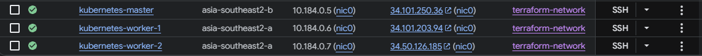

Sesuai tugas saya membuat 3 VM untuk 3 node, master dan 2 worker

Saya menggunakan K3S - Lightweight Kubernetes untuk tugas ini dan mengikuti cara penginstallan dari repository kubernetes/k3s mentor.

```sh
$ ssh miral@ipmaster

$ sudo su

# Command dibawah digunakan jika penamaan node2/VM sama saat login, jadi di bedakan kalau host ini master
# Lakukan hal yang sama buat worker jika perlu

$ hostnamectl set-hostname master 
$ echo master > /etc/hostname # --> Bisa melakukan ini atau logout login hostnya

$ curl -sfL https://get.k3s.io | sh - # --> Install K3S

$ k3s kubectl get nodes # --> Command buat cek saja, ini buat memanggil node2 yang ada di kubectl, atau systemctl k3s status juga bisa

$ export PATH=/usr/local/bin:$PATH # --> Buat bisa langsung akses ke kubectl tanpa tulis k3s, contoh:

$ kubectl get nodes
```

Buat node worker kurang lebih sama, ubah hostname aja ke worker jika perlu tetapi link curlnya berbeda:

```sh
$ curl -fL https://get.k3s.io | sh -s - server --token <token> --disable-etcd --server https://node1:6443
```

Buat <token> ini di ambil dari node master yang muncul setelah meng-install K3S di maste atau bisa di ambil disini:

```sh
$ cat /var/lib/rancher/k3s/server/token
```

Setelah penginstallan nanti cara pengecekannya berbeda karena yang di install bukan k3s di worker melainkan k3s-agent

```sh
$ systemctl status k3s-agent
```

Kemudian saya ubah juga config K3S di /etc/rancher/k3s/config.yaml di master atau /etc/rancher/node/config.yaml

Config di master:

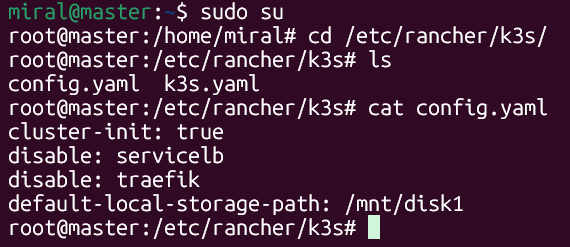

Config di worker:

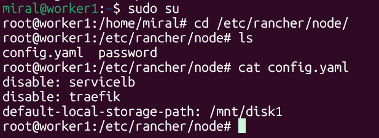

traefik di disable biar kita bisa menggunakan ingress nginx

Dengan begitu sudah di install kubernetes di server kita

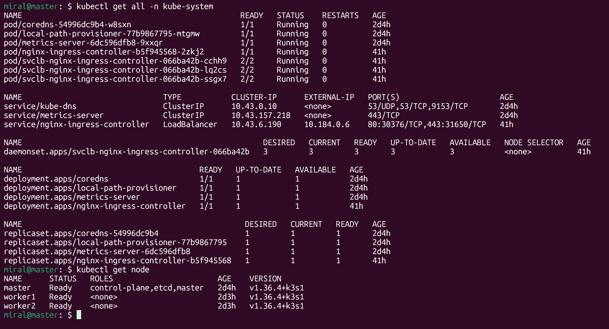

## Install Ingress Nginx

Buat penginstallan bisa menggunakan manifest atau helm, buat saya sendiri menggunakan helm

```sh
$ helm install nginx oci://ghcr.io/nginx/charts/nginx-ingress --version 2.7.3
```

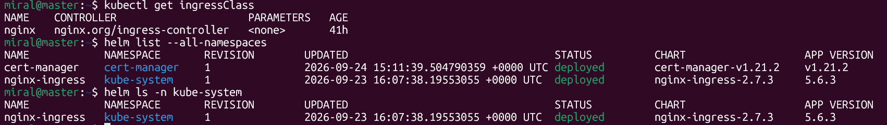

Ingress NGINX digunakan kurang lebih mirip dengan apa yang saya ingin capai dengan membuat reverse-proxy di nginx, ini juga bisa dilakukan menggunakan traefik tapi buat tugas ini di minta menggunakan nginx ingress

## Men-deploy aplikasi

Karena area ini berbeda dengan sebelumnya, jadi saya perlu adjust buat bagaimana backend konek dengan database menggunakan kubernetes  
Biar mudah ini Step by Step cara saya deploy aplikasi:

1. Men-deploy database (Termasuk user, password, database, dll.)
2. Build ulang Backend (Sesuaikan dengan IP database yang baru)
3. Men-deploy Backend
4. Men-deploy Frontend
5. Buat Wildcars SSL Certificate buat aplikasi

### Database

[Manifest mysql](kubernetes/mysql.yaml)

Saya membuat secret buat deployment mysql dan servicenya menggunakan ClusterIP: None

Secret:  
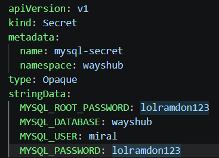

Service:  
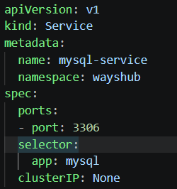  
ClusterIP: None itu agar database tidak bisa diakses melalui IP dan tidak terlihat IP nya  
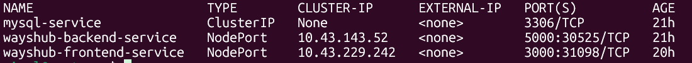

Deployment:  
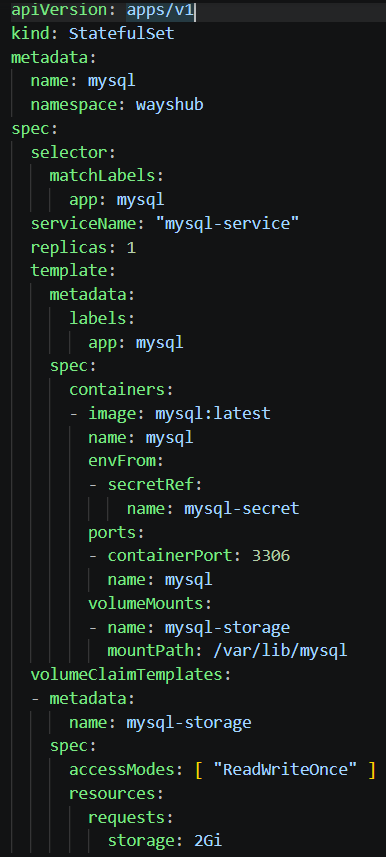  
MySQL di deploy menggunakan statefulset, dengan persistent volume langsung di statefulset dengan volumeClaimTemplates

### Backend

Sebelum saya deploy backend saya ubah IP database di config jsonnya terlebih dahulu:  
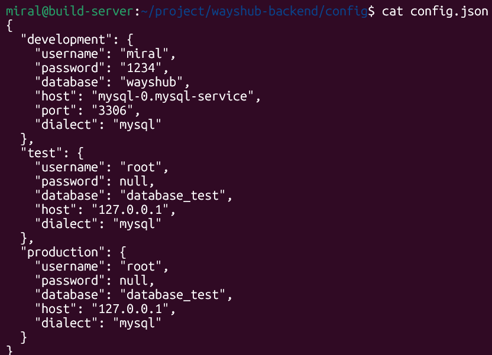

Kemudian saya ubah di Dockerfile agar tidak langsung migrate, jaga-jaga error jika tidak konek ke database:  
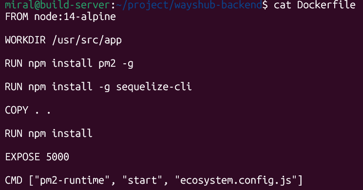

Setelah itu saya build Dockerfilenya seperti tugas minggu-minggu lalu, dengan nama image millinovz/wayshub:kub  
Penamaan sebenarnya typo harusnya wayshub-backend tapi saya tetap lanjutkan saja

[Manifest deploy backend](kubernetes/backend.yaml)  

Saya mendeploy backend dengan secret buat env backend, service buat bisa diakses backendnya, ingress buat konek backend ke domain  
Secret sebenernya bisa saja tidak ada, tetapi saya membuat docker untuk ignore .env di dalamnya jadi saya buat ulang .env nya di secret dan kemudian saya delete yaml nya

Deployment:  
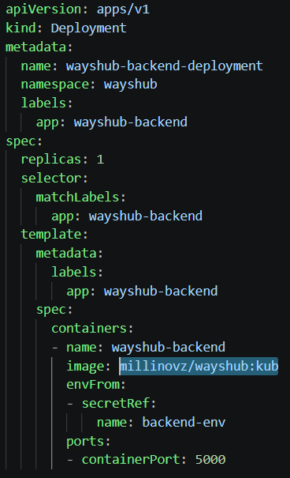

Service:  
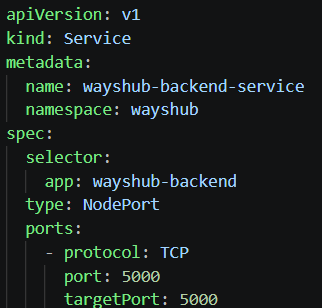  
portnya saya samakan 5000 dengan port backend

Ingress:  
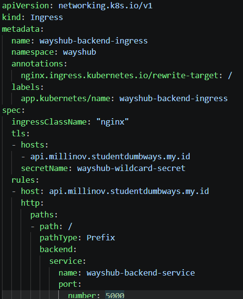
secretName nya itu untuk konek ke certificatenya yang akan saya jelaskan nanti

### Frontend

[Manifest deploy frontend](kubernetes/frontend.yaml)  

Buat frontend saya tidak ubah apa-apa, jadi saya menggunakan docker image saya dari minggu sebelumnya millinovz/wayshub-frontend:v1

Deployment:  
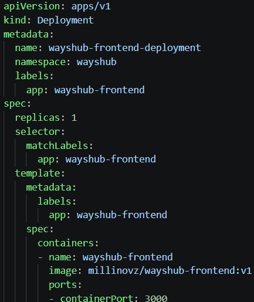

Service:  
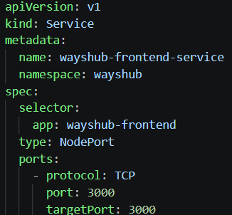

Ingress:
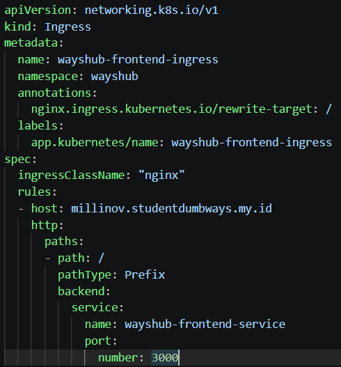

## Cert Manager

Saya menginstall cert-manager secara default staticnya:

```sh
$ kubectl apply -f https://github.com/cert-manager/cert-manager/releases/download/v1.21.2/cert-manager.yaml
```

Hasil install cert manager:  
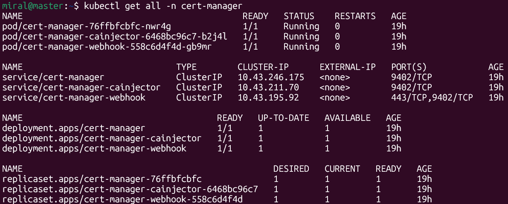

Kemudian saya buat ClusterIssuer agar bisa digunakan di semua namespace:  
[Manifest Cert](kubernetes/cert-issuer.yaml)  

Saya membuat secret di dalamnya untuk token cloudflare buat SSL Wildcard, token di dalam situ hanya contoh dan sudah aku hapus di terminal saya

ClusterIssuer:  
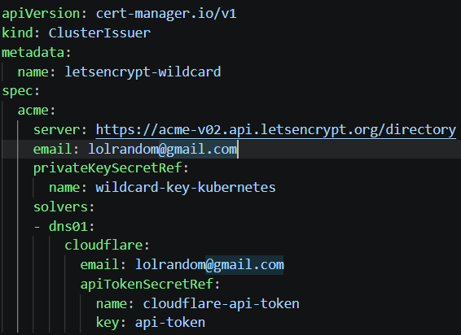  

Certificate:  
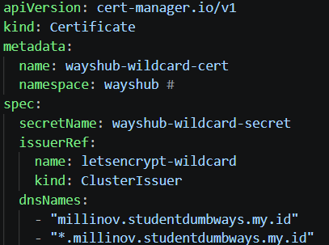
Nanti secretName-nya ini dipanggil lagi di Ingress aplikasi, sudah dibuat settingnya wildcard

## Dokumentasi lainnya

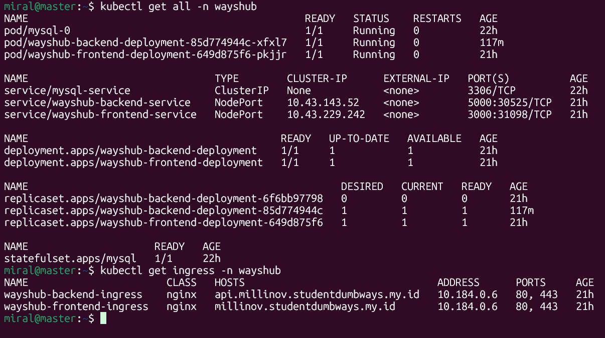


