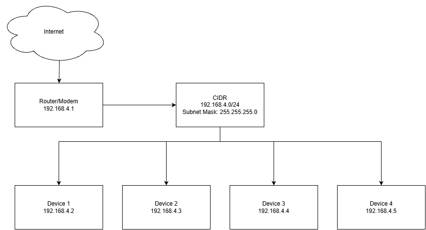
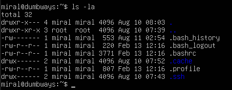
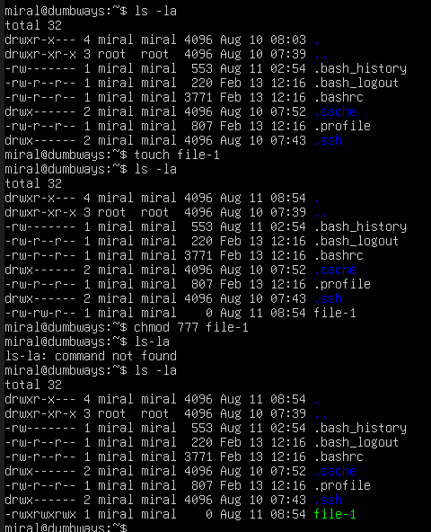
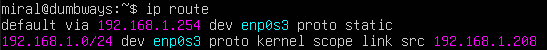
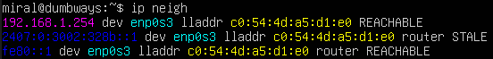
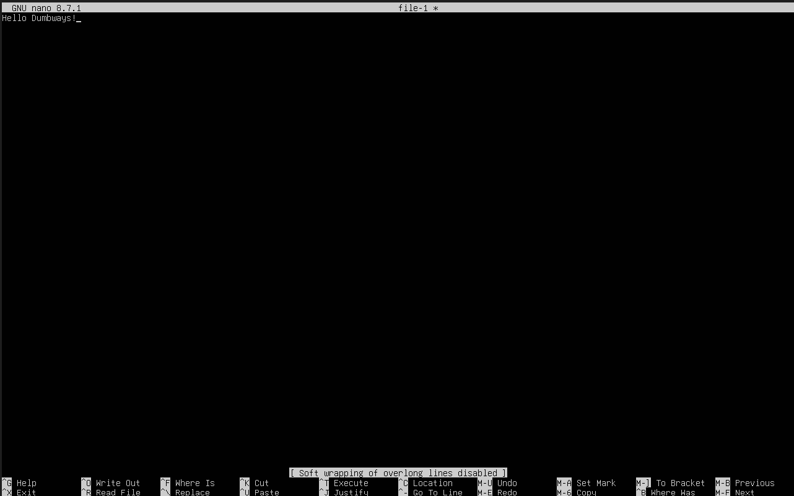
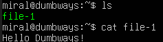
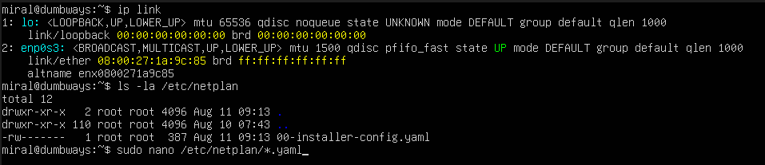
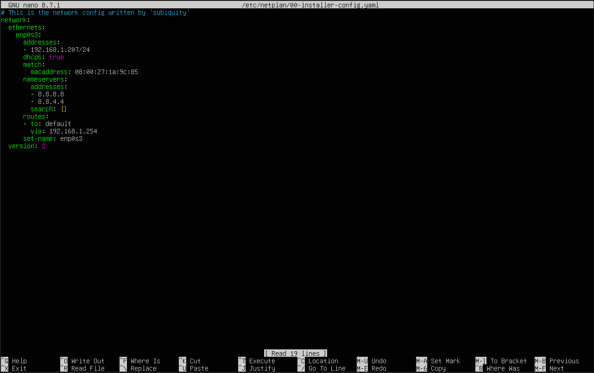
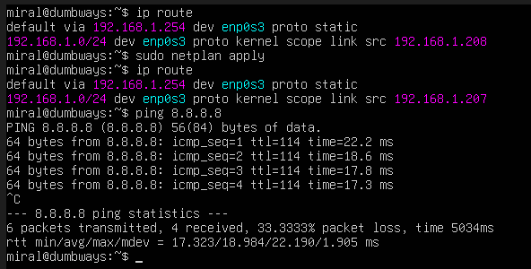

# Task Day 2

Disini saya mengerjakan task Bootcamp DevOps Day 2

## Task 1: Diagram



## Task 2: Perbedaan SH (Shell) dan BASH (Bourne-Again Shell)

Secara garis besar BASH itu adalah Shell dengan banyak fitur tambahan, jadi Shellnya itu adalah basicnya
Shell ada salah satu language prograaming juga makanya ada konsep "Shell Script" dan "Bash Script"

Dalam linux command juga terlihat perbeddan saat ingin menggunakan SH dan saat menggunakan BASH

BASH:
```bash
miral@dumbways:~$ 
```
Sementara SH hanya ada tanda dollar di depannya seperti
SH:
```bash
$
```

Selain itu juga yang saya tangkap dari pencarian perbedaan kedua ini sepertinya bash bisa mengetahu array sementara shell sendiri tidak, tapi saya tidak menemukan contohnya. Kesimpulan yang saya dapatkan adalah BASH itu adalah Shell tapi Shell belum tentu BASH, karena selain BASH shell juga mempunyai shell-shell lainnya

## Task 3: Kumpulan Command Linux

```bash
miral@dumbways:~$ ping 8.8.8.8
```
Menge-ping IP yang ditujukan

```bash
miral@dumbways:~$ ls
```
Memunculkan list directory dan file yang ada

```bash
miral@dumbways:~$ mkdir dumbways
```
Membuat folder/directory, ex: dumbways disini

```bash
miral@dumbways:~$ cd dumbways
```
```bash
miral@dumbways:~/dumbways$ cd ..
```
Me-navigate ke directory, contoh disini ke directory dumbways dan (..) untuk balik ke home

```bash
miral@dumbways:~$ touch file-1
```
Membuat file empty dilanjuti dengan nama file ex:file-1

```bash
miral@dumbways:~$ cp file-1 file2
```
Meng-copypaste file dengan kata pertama itu filenya (file-1) dan kata kedua nama pastenya (file2)

```bash
miral@dumbways:~$ mv file2 dumbways/file2
```
Memindahkan file dengan kata pertama nama filenya dan kedua tempat pindahnya dilanjuti dengan nama filenya setelah di pindah, tapi tidak hanya itu fitur mv
```bash
miral@dumbways:~$ cd dumbways
```
```bash
miral@dumbways:~/dumbways$ mv file2 file-2
```
Jika tidak ada directory di kata kedua maka file itu tetap di tempat yang sama, tetapi jika namanya dirubah maka filenya akan berubah nama, jadi fitur ini bisa juga digunakan untuk me-rename file

```bash
miral@dumbways:~/dumbways$ cd ..
```

```bash
miral@dumbways:~$ echo "Hello Dumbways"
Hello Dumbways
```
Meng-echo string yang ditulis setelah echo, tapi fiturnya bisa digunakan untuk menulis file

```bash
miral@dumbways:~$ echo "Hello DUmbways" > file.js
```
Dengan command diatas string tersebut ditulis di dalam file.js, dimana file itu bisa kita display dengan
```bash
miral@dumbways:~$ cat file.js
Hello DUmbways
```
Selain itu juga echo bisa digunakan untuk menambah tulisan di file dengan
```bash
miral@dumbways:~$ echo "Hello Dmbways" >> file.js
miral@dumbways:~$ cat file.js
Hello DUmbways
Hello Dmbways
```
Nah tetapi jika kita ulang echonya dengan 1 (>)
```bash
miral@dumbways:~$ echo "Hello Dumbways" > file.js
miral@dumbways:~$ cat file.js
Hello Dumbways
```
Maka file akan di overwritten dengan string baru

```bash
miral@dumbways:~$ ls -la
```
ini seperti list tapi akan menampikan secara detail semua file dan directory termasuk yang hidden dengan penjelasan permission untuk file/directory tersebut



Selain itu juga ada command ```bash chmod``` yang mungkin lebih enak dijelaskan dengan screenshot



Jadi chmod bisa merubah permission suatu file/directory dimana dengan 777 file itu bisa di lihat (r) di edit/tulis (w) dan execute (x) oleh user, group, dan publik

```bash
miral@dumbways:~$ ip route
```

```bash
miral@dumbways:~$ ip neigh
```


Dua command diatas ini saya dapat kemarin dari task 1 untuk mengetahui linux saya mendapat internet atau tidak dengan mencari tau IP linux itu


```bash
miral@dumbways:~$ nano file-1
```



Nano adalah command untuk membuka fitur writenya linux dimana disitu ada UI nya sendiri dan digunakan untuk mengedit isi file

## Bonus Challenge: Ubah IP





Saya mengikuti artikel [ini](https://medium.com/@ferryanandafebian/cara-konfigurasi-ip-static-di-ubuntu-86aca0b4d360)


