# Task Day 3

Disini saya mengerjakan task Bootcamp DevOps Day 3

## Task 1: Akses Server Melalui Terminal

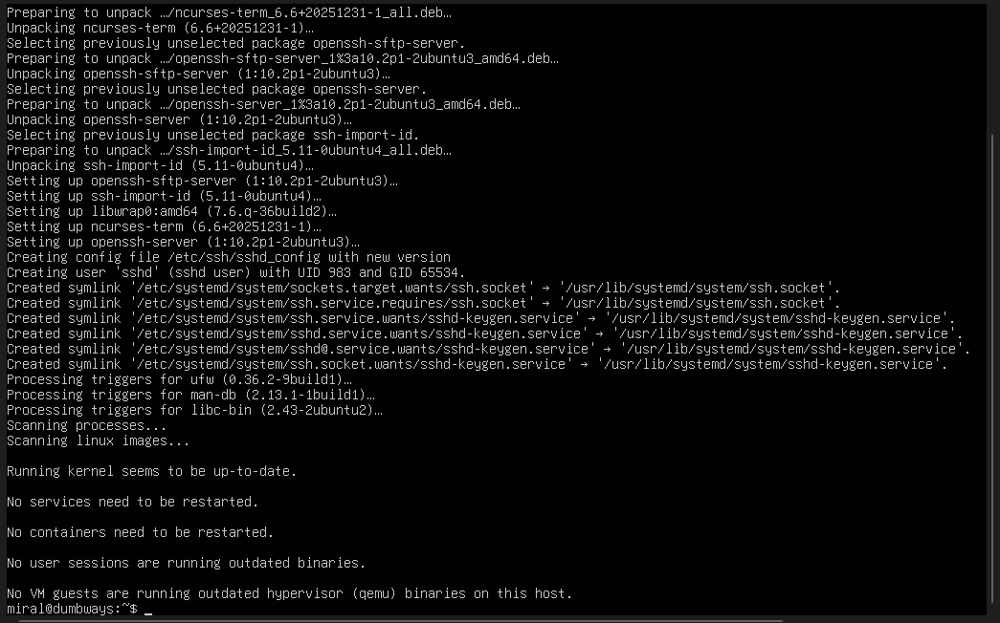

Sebelumnya saya install dulu ssh di linux kemudian baru saya bisa login melalui terminal

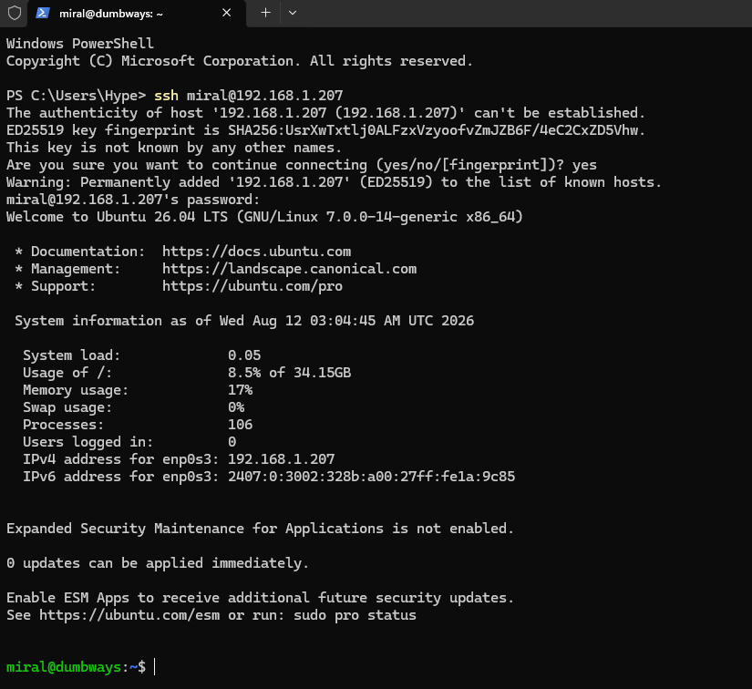

Tapi saya juga tau cara cepatnya biar tidak perlu isi password lagi dengan men-generate key di .ssh dalam folder Users saya

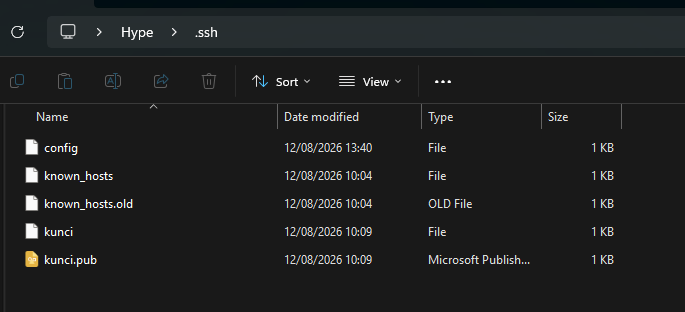

Membuka file .pubnya dan men-copy paste keynya ke authorized_keys di .ssh

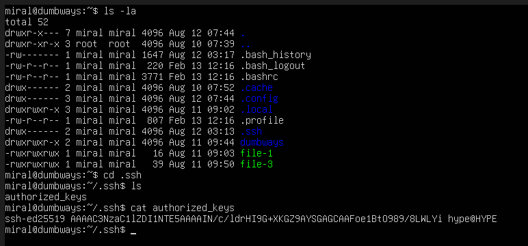

Dan kemudian bisa login seperti di bawah ini

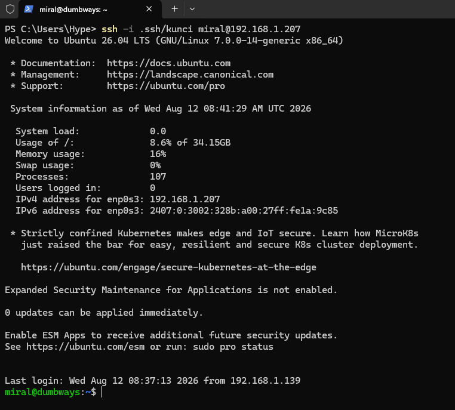

Dan tentu setelah itu ada cara lebih cepat juga dengan menambah config di .ssh windows

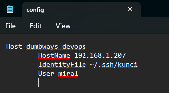

Dimana setelah itu bisa login seperti ini 

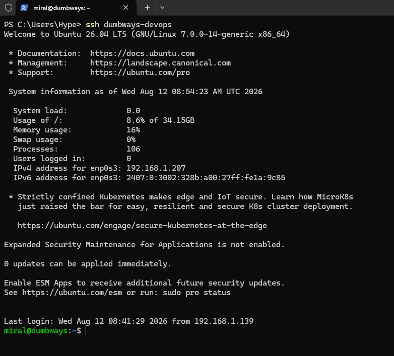

## Task 2: Konfigurasi SSH (Public Key, Password Opsional)

Oke ini di akses di /etc/ssh di file sshd_config

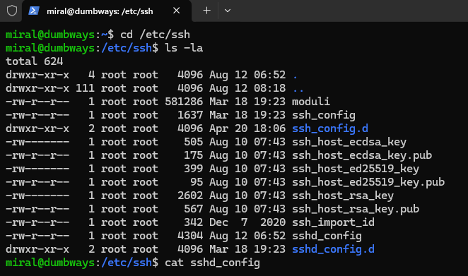

Filenya ini sudah saya edit jadi saya kasih liat yang saya ubah

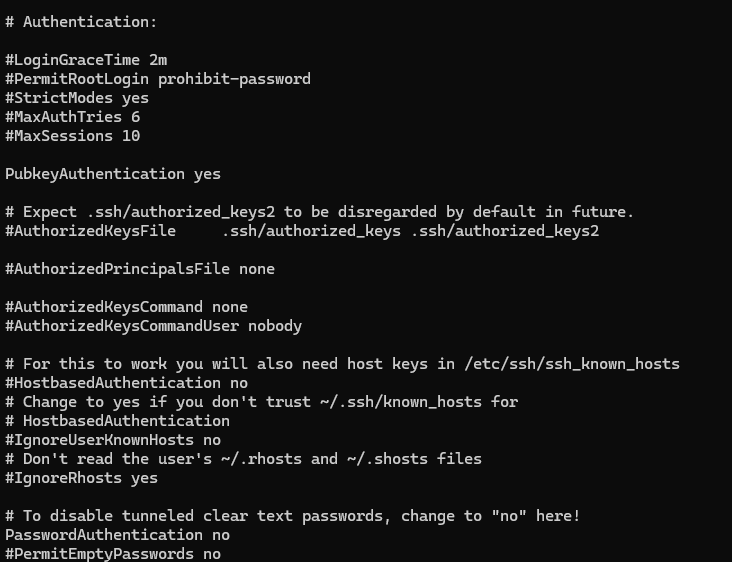

Jadi yang di barisnya ada tanda ```#``` itu berarti komen, dan saya unkomen PubkeyAuthentication dan PasswordAuthentication
untuk PasswordAuthentication saya ubah dari 'yes' menjadi 'no

setelah itu saya menjalankan
```bash
sudo systemctl restart ssh
```
Untuk me-restart ulang SSH

## Task 3: Buat step by step penggunaan text manipulation! (grep, sed, cat, echo)

### echo
```bash
miral@dumbways:~$ echo "Hello Dumbways"
Hello Dumbways
```
Meng-echo string yang ditulis setelah echo, tapi fiturnya bisa digunakan untuk menulis file

```bash
miral@dumbways:~$ echo "Hello DUmbways" > file.js
```
Dengan command diatas string tersebut ditulis di dalam file.js, dimana file itu bisa kita display dengan
```bash
miral@dumbways:~$ cat file.js
Hello DUmbways
```
Selain itu juga echo bisa digunakan untuk menambah tulisan di file dengan
```bash
miral@dumbways:~$ echo "Hello Dmbways" >> file.js
miral@dumbways:~$ cat file.js
Hello DUmbways
Hello Dmbways
```
Nah tetapi jika kita ulang echonya dengan 1 (>)
```bash
miral@dumbways:~$ echo "Hello Dumbways" > file.js
miral@dumbways:~$ cat file.js
Hello Dumbways
```
Maka file akan di overwritten dengan string baru

### cat
Seperti yang di lihat di atas cat digunakan untuk melihat file
```bash
miral@dumbways:~$ cat file.js
Hello Dumbways
```
Tetapi tidak hanya itu, misal kita menulis command seperti ini
```bash
miral@dumbways:~$ cat > file-2
```
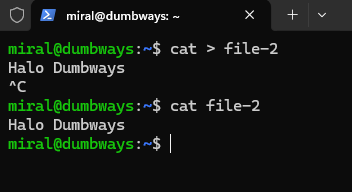

Kalau seperti command diatas makan cat akan membuat file baru/overwrite existing file dimana baris selanjutnya itu adalah isi file tersebut kita bisa isi langsung setelah command diatas

Selain itu bisa juga di buat seperti ini
```bash
miral@dumbways:~$ cat file-1 file-2 > file-3
```
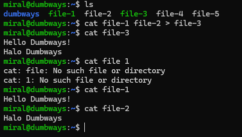

Jika kita memberi nama file sebelum tanda (>) maka file selanjutnya akan dibuat/overwritten menjadi file sebelumnya, dan di contoh diatas juga memperlihatkan kalau ini bisa lebih dari 1 file

### sed
sed kurang lebih salah satu fungsinya yang diajarkan untuk me-replace string tertentu di dalam file sesuai dengan commandnya
```bash
miral@dumbways:~$ sed -i 's/Hello/Hai/g' file-1
```
-i itu adalah in-place untuk edit files in place, bisa di lihat full di sed -help

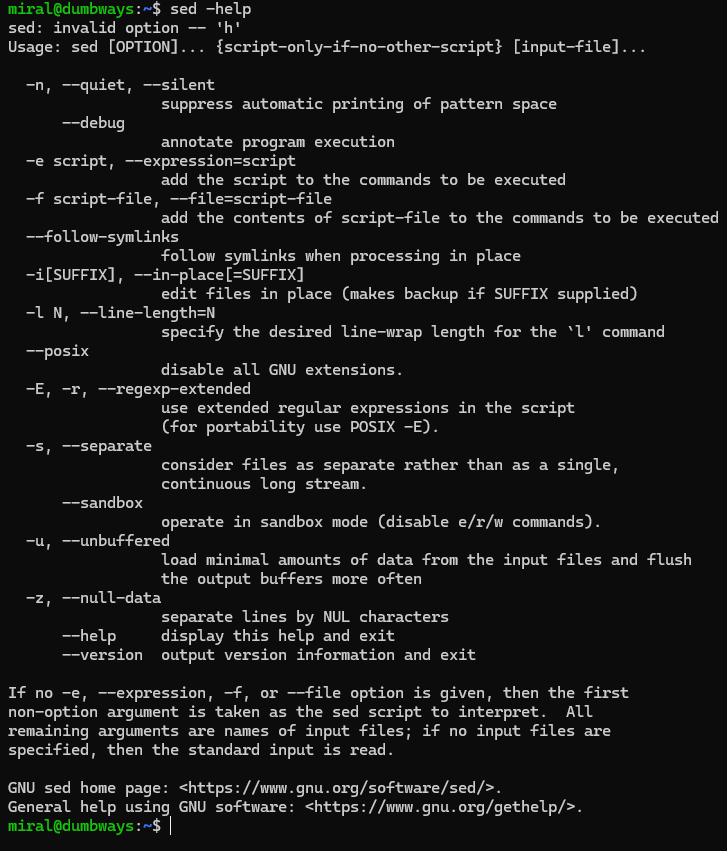

Contoh penggunaan commandnya seperti ini:

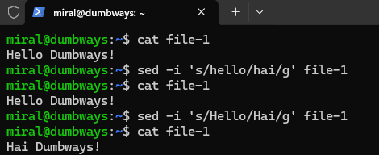

Commandnya juga case sensitive jadi harus sesuai dengan kata yang mau di ganti

### grep
grep digunakan untuk menemukan kata di dalam file, dimulai dari grep kemudian nama file/seluruh file (.*)
```bash
miral@dumbways:~$ grep Hello file-1
```
Dari command diatas berarti grep akan mencari "Hello" di dalam file-1 selain itu juga grep bisa menghitung berapa banyak line dengan kata tersebut dengan (-c)
```bash
miral@dumbways:~$ grep -c Hello file-1
```

Di bawah ini adalah contoh output dari command diatas:

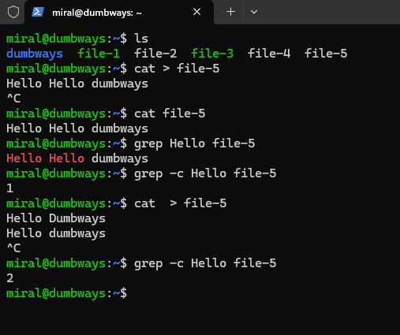

Berikut contoh dengan semua file:

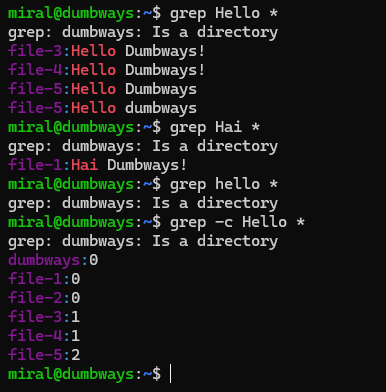

Commandnya juga case sensitive jadi harus sesuai dengan kata yang mau di ganti

## Task 4: Nyalakan ufw dengan memberikan akses untuk port 22, 80, 443, 3000, 5000 dan 6969!

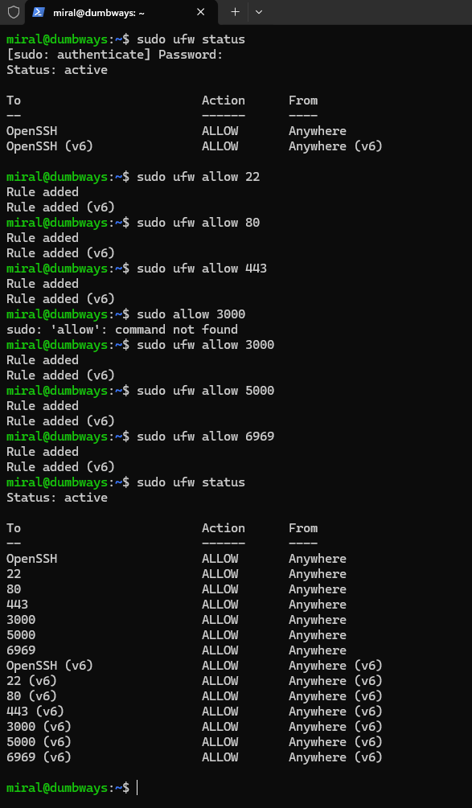


