# Task Day 4

Disini saya mengerjakan task Bootcamp DevOps Day 4

## Task 1: Penjelasan Git

Git itu adalah sebuah Version Control System yang dibuat oleh Linus Torvalds. Yang dimaksud Version Control System itu adalah sistem untuk melacak perubahan-perubahan di koding dari history perubahan kode sampai kontrol kodingan dari multiple programmer. Dengan sistem ini developers bisa dengan gampang mencari tau perubahan terjadi dari mana oleh siapa dan dengan udah bekerja sama dengan developers lainnya.

## Task 2: Buat sebuah repositori

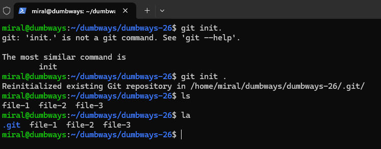

Pertama saya inisialisasi gitnya di lokal, di screenshot diatas juga bisa dilihat saya sudah memasuki 3 file di dalamnya, biar plus juga saya juga tambah .gitignore selanjutnya

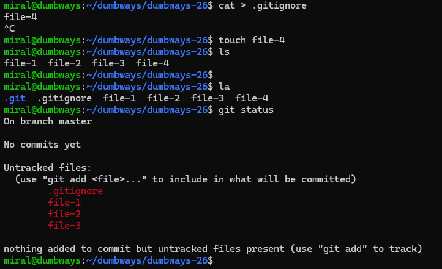

Selanjutnya saya masukan file ini ke staging dan kemudian di commit

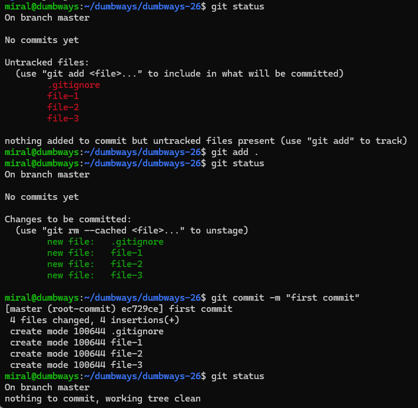

Untung menge-push commit in ke git hub pertama-tama saya buat repo dengan nama yang sama

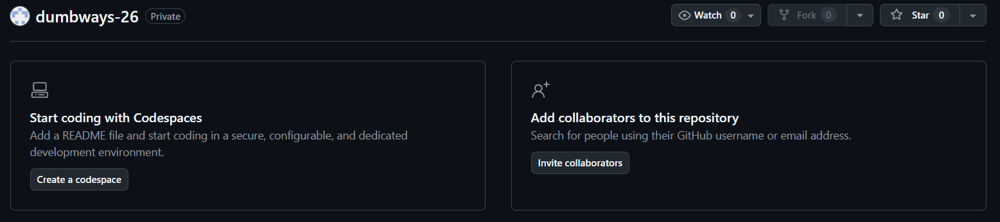

terus mengikuti petunjuk di github untuk menghubungkan git ini


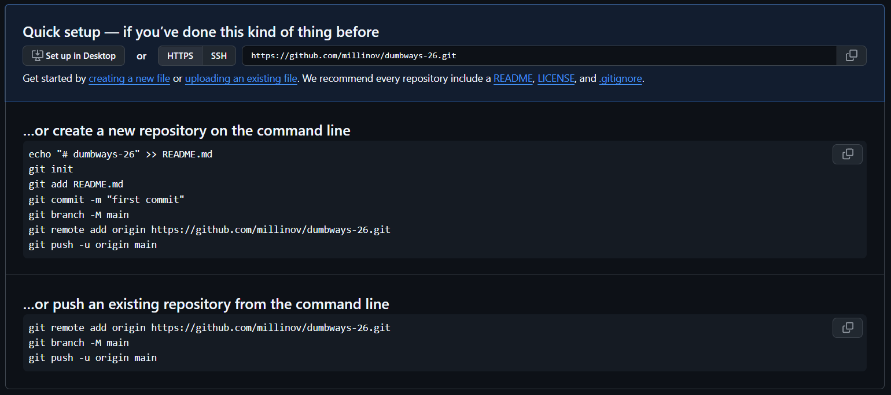

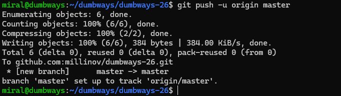

## Task 3: Manage Repo tugas kalian dengan terminal

Nah sebenernya dari di atas bisa di lihat kalau saya me-manage dengan terminal, saya munculkan juga screenshot trial & error yang saya lakukan

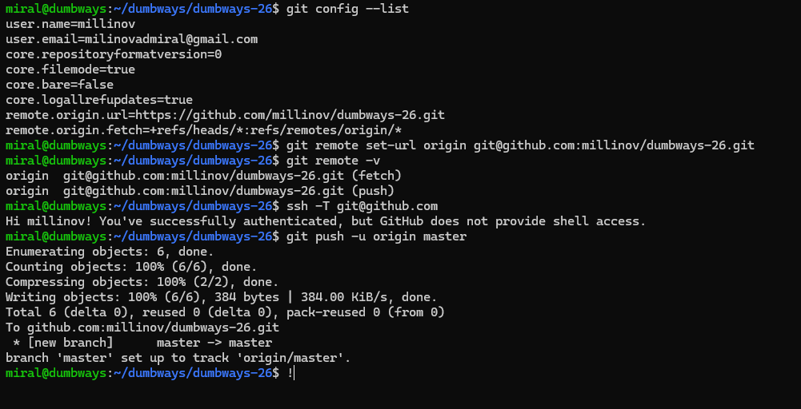

Saya juga bisa membuat branch lokal baru di terminal

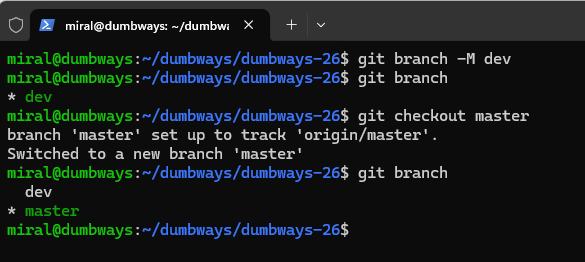

## Task 4: Demokan cara untuk mencari perubahan text pada suatu file di GitHub!

Sebelumnya saya buat dulu perubahan dalam salah satu file

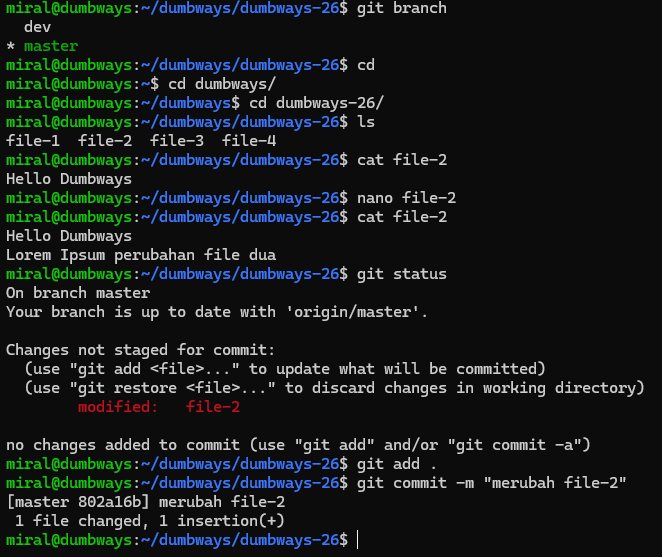

Ini saya sudah commit di git lokal, salah satu cara untuk melihat perubahan text adalah dengan ```git log```

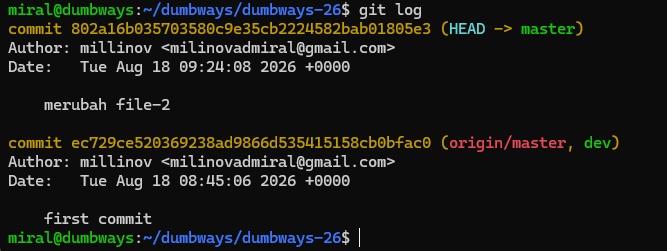

Atau jika sudah di push ke origin bisa langsung di cek di github

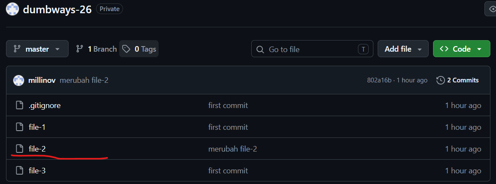

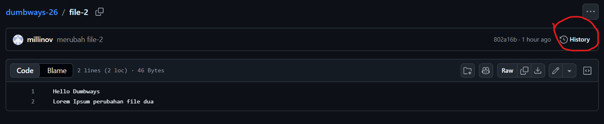

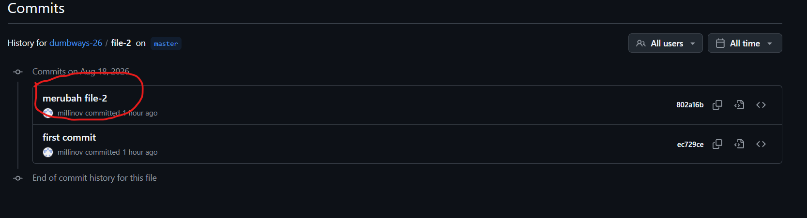

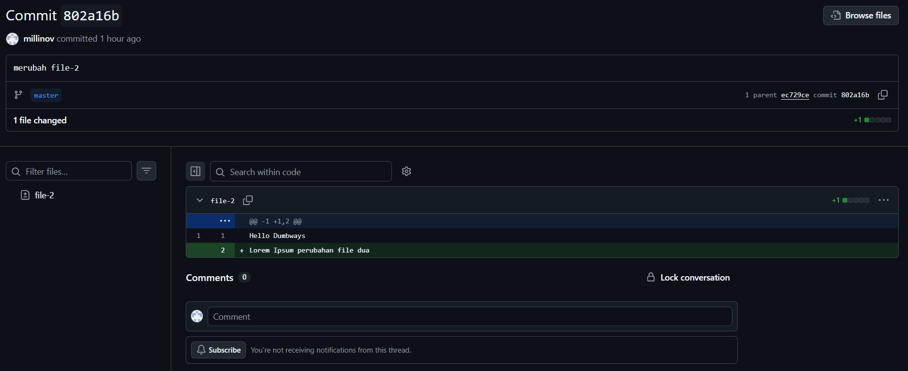