# Task Day 5

Disini saya mengerjakan task Bootcamp DevOps Day 5

## NodeJS

Pertama-tama saya clone dulu app nya

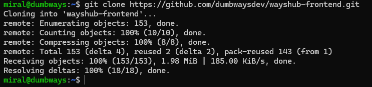

Menngunakan NodeJS v10

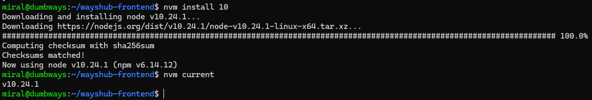

Install dependenciesnya

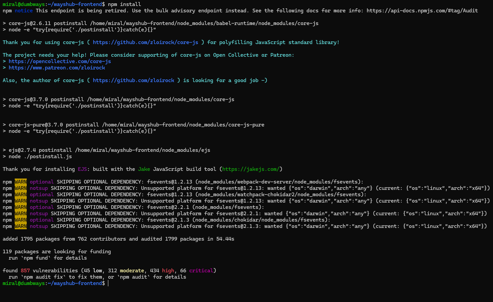

Ubah urlnya di src/config/api.js agar menggunakan port 3000

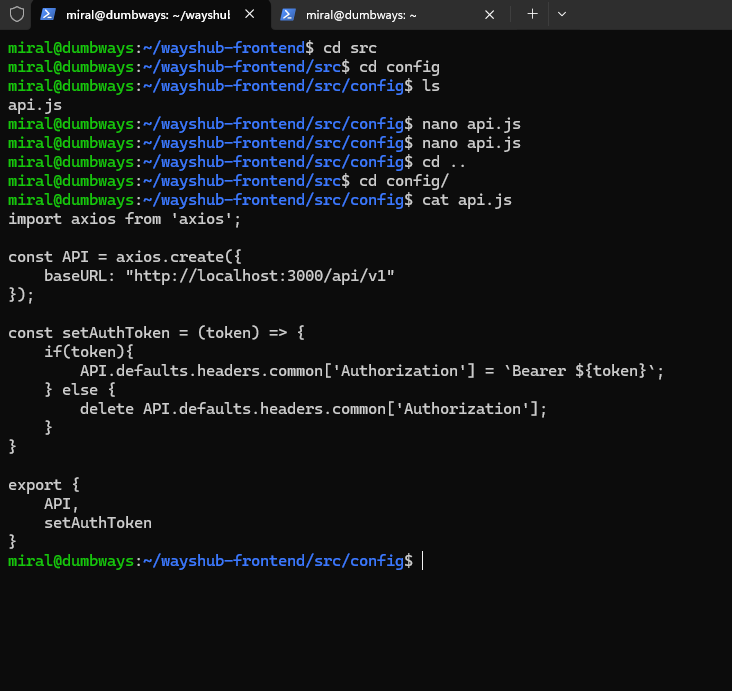

Kemudian di run

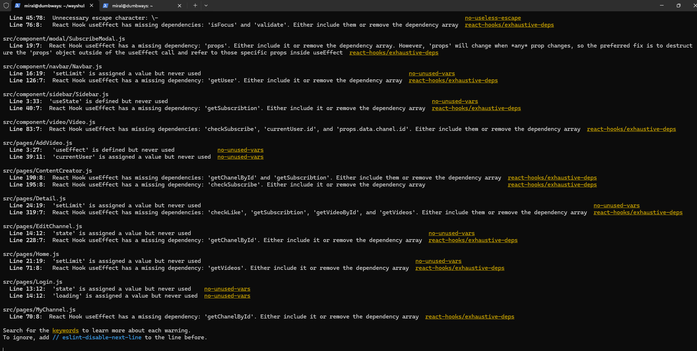

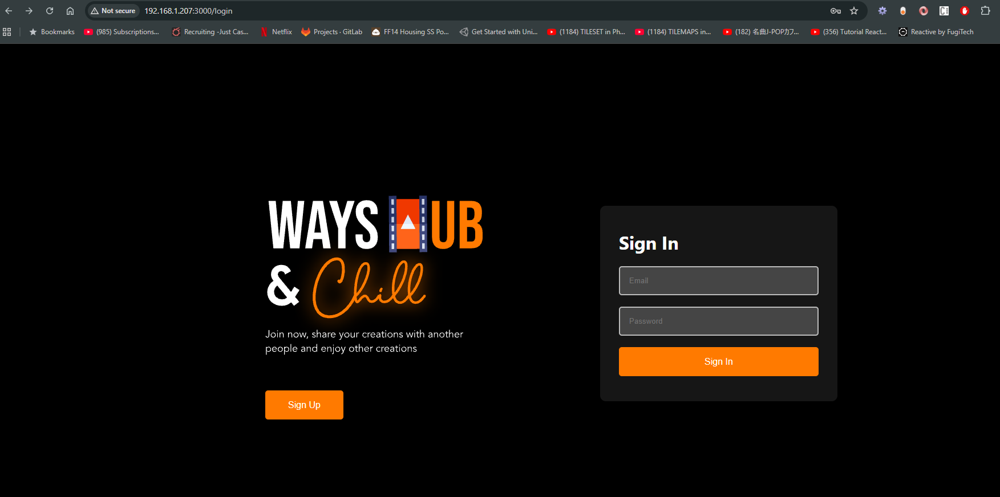

Kemudian menggunakan NodeJS v12

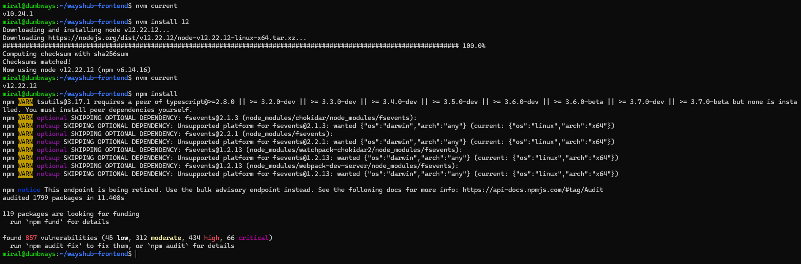

Dan bisa jalan sama dengan nodejs 10

## Python

Python sudah ada di dalam Linux jadi saya tinggal meng-install flask untuk membuat simple app ini

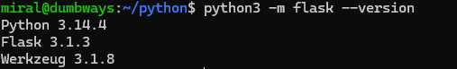

Kemudian saya siapkan kodingannya, di port 5000

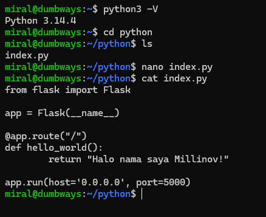

Kemudian saya jalankan

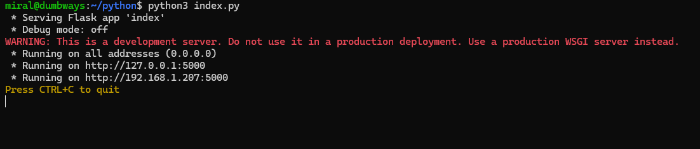

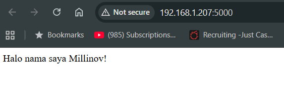

## Golang

Pertama saya install dulu golang di linux

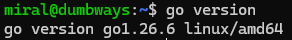

Kemudian saya bikin kodingannya dan saya run

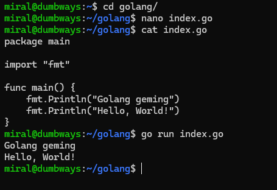

## Bonus Challenge: Run app on background

Saya menggunakan pm2 untuk challenge ini 

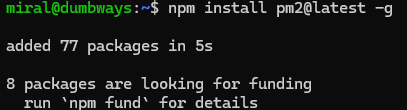

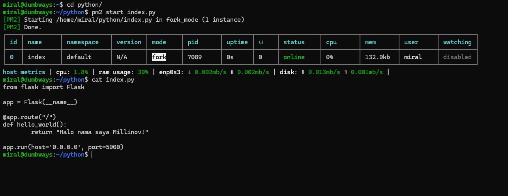