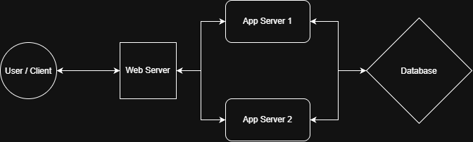
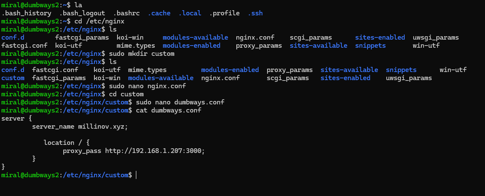
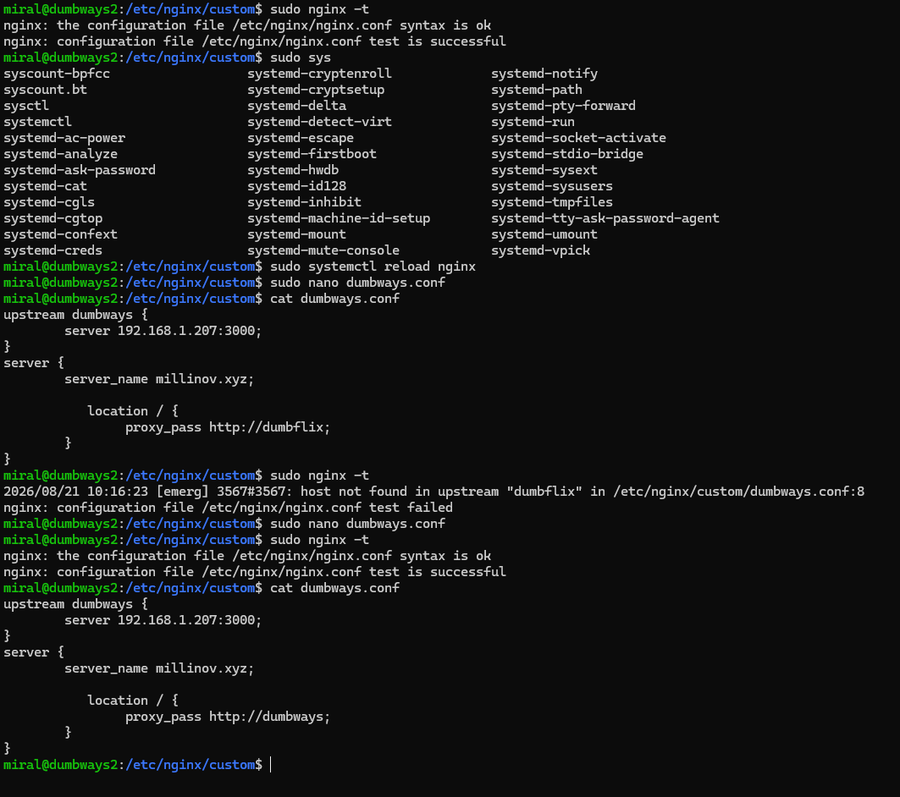
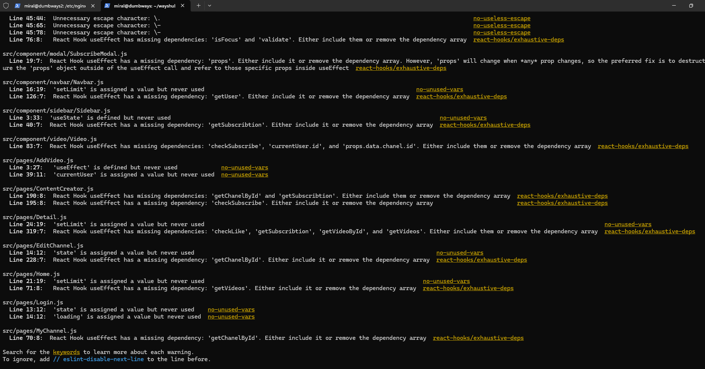
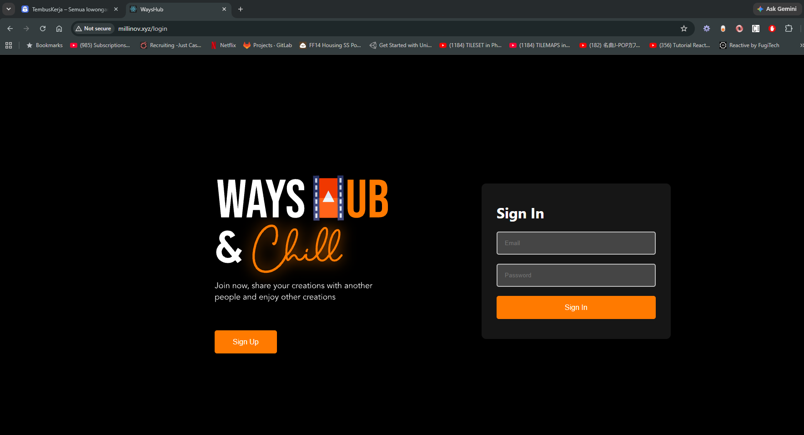

# Task Day 6

Disini saya mengerjakan task Bootcamp DevOps Day 6

## Gambarkan sturktur web server menggunakan reverse proxy

Contoh app server 1 di 192.168.1.201:3000 dan app server 2 di 192.168.1.203:3000

Tanpa web server maka client harus mengakses langsung dengan http://192.168.1.201:3000
Dengan web server kita bisa buat contoh dengan http://dumbways.xyz
Jadi web server itu adalah semacam perantara/pintu untuk mengakses aplikasinya

Kenapa disebut reverse proxy? Kalau proxy biasa itu untuk menjaga client/user, maka reverse proxy untuk menjaga server aplikasi

##  Buatlah Reverse Proxy untuk aplilkasi yang sudah kalian deploy kemarin. (wayshub), untuk domain nya sesuaikan nama masing

Pertama saya setup nginx di vm buat web server (dumbways2/192.168.1.205)

Kemudian saya nyalakan app server wayshub (dumbways/192.168.1.207)

Kemudian juga add di host windows nama linknya

dan aplikasi berjalan di millinov.xyz

