# Task Day 8 / Week 4 / Week 2 Stage 2

Disini saya mengerjakan task Bootcamp DevOps Day 8 atau Week 4 atau Week 2 Stage 2, Penamaan biar sama saya buat foldernya day 8.
Tasknya sendiri dikerjakan selama 1 minggu ini di week 4 bootcamp.

Buat pengerjaan saya akan buat dari cara pengerjaan saya baru saya pinpoint dari mana di task yang sudah saya kerjakan

## Setup server

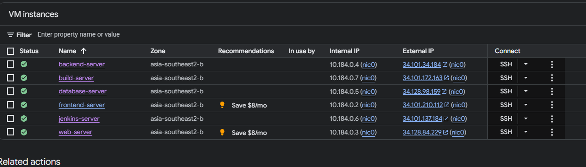

Masih sama, ada tambah build server dan jenkins server 
Jenkins server untuk website jenkins nanti
Build server untuk menge-build image docker dan juga dipakai untuk testing

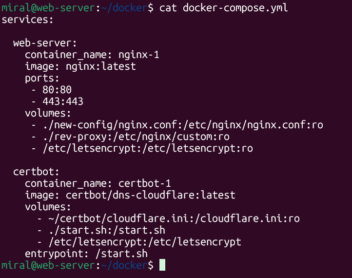

Ini docker compose yang saya buat untuk web-server
ada nginx buat reverse proxy dan certbot untul ssl

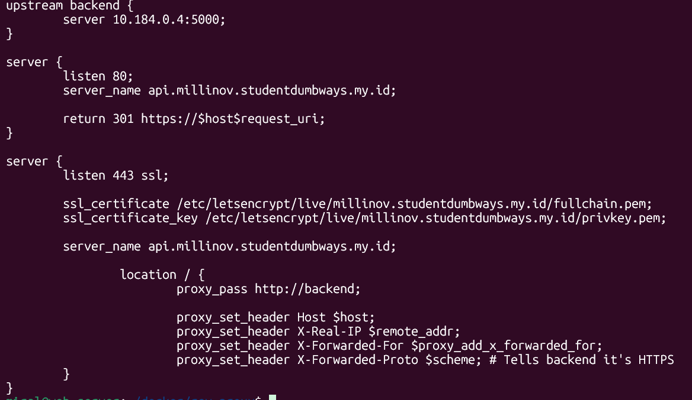

Masing server sudah aku buat confignya kurang lebih sama seperti di atas, menggunakan ssl_certificate yang sama

Bisa di cek kerja atau tidak aplikasinya disini [Wayshub](https://millinov.studentdumbways.my.id/)
Saya menggunakan repository wayshub buat pengerjaan tugas kali ini

## Docker

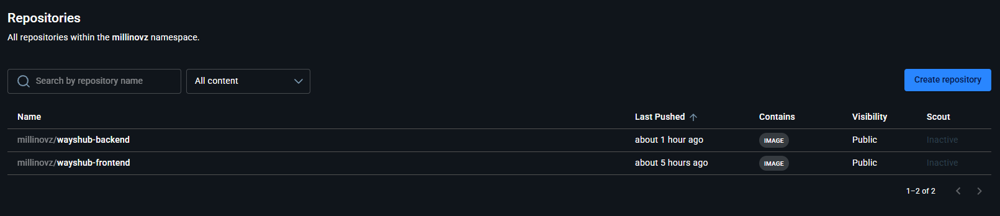

Saya juga sudah build docker image dan aku push ke akun aku
Image di build menggunakan Dockerfile

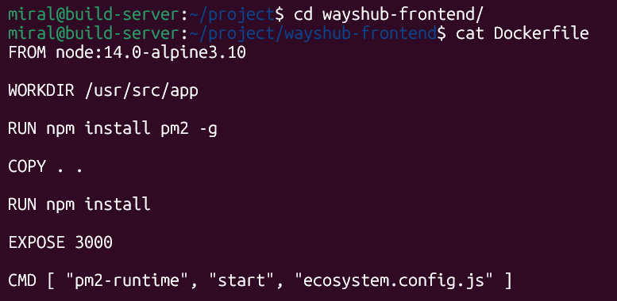

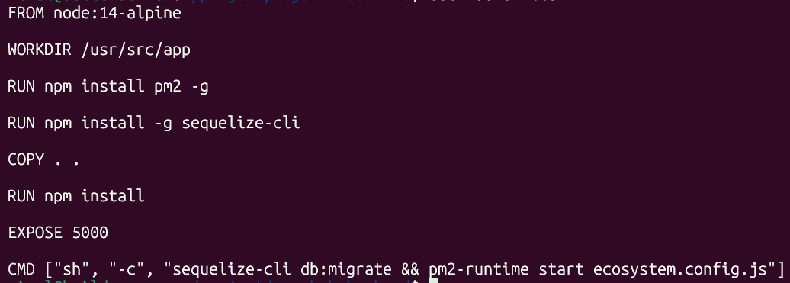

Selain itu juga aku menggunakan node:14-alpine karena lebih ringan imagenya nanti

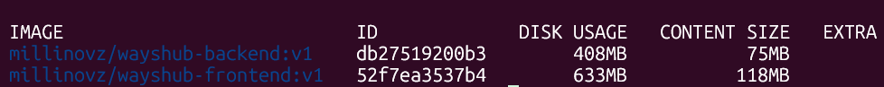

Sebelumnya jika hanya node:14 sizenya bisa 3-4x lipat dan disk sizenya hampir mencapai 2GB

## Jenkins

Saya sudah build jenkins di docker dan sudah berjalan dan bisa di akses dibawah

[Jenkins](https://jenkins.millinov.studentdumbways.my.id/)

Link diatas sudah di reverse proxy juga menggunakan ketentuan Jenkins seperti di bawah

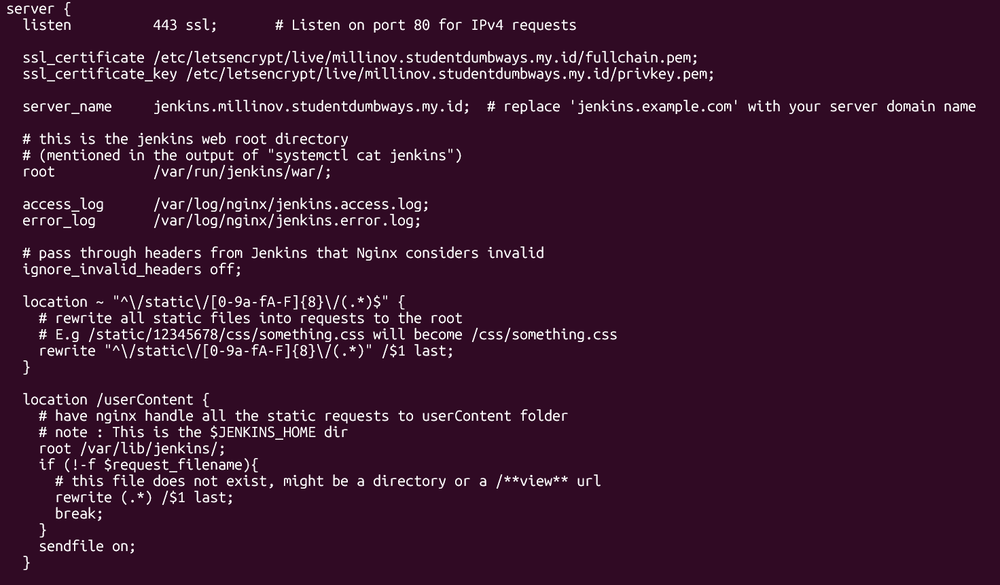

Untuk tugas jenkins saya buat untuk CI/CD wayshub-frontend, sebelumnya juga repositorynya sudah saya copy untuk repository saya sendiri

### Setup credentials di Jenkins

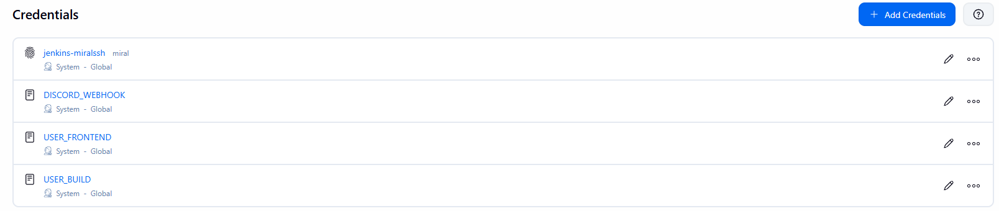

Saya ada 4 credentials 

1. jenkins-miralssh : ini key untuk aku akses ke server yang key itu bisa akses
2. DISCORD_WEBHOOK : ini secret text untuk link discord webhook aku
3. USER_FRONTEND : ini secret text yang isinya user dan host frontend untuk mengakses frontend
3. USER_BUILD : ini secret text yang isinya user dan host build untuk mengakses build

### Jenkinsfile untuk job Jenkins

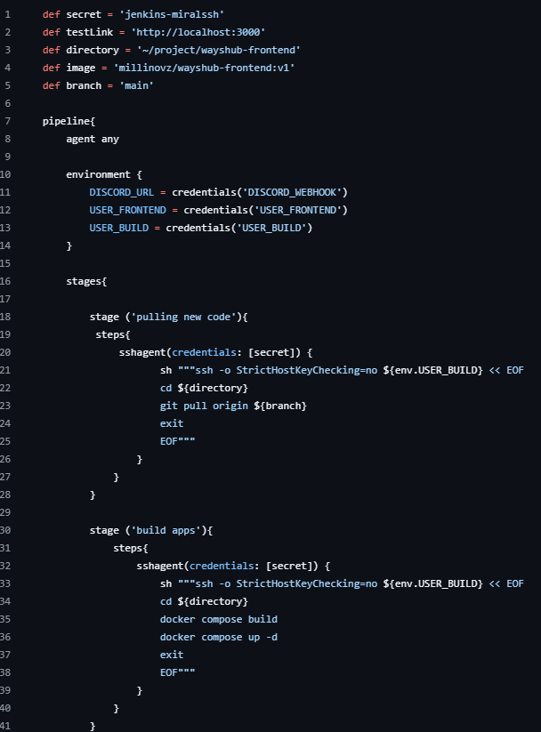

Foto di atas hanya memperlihatkan separuh jadi bisa lihat keseluruhan disini

[Jenkinsfile](https://github.com/millinov/weyshub-frontend/blob/main/Jenkinsfile)

Jobnya:
1. Build imagenya lagi di server build
2. Run dan test dan kemudian matikan aplikasi frontend di build
3. Jika sukses imagenya di push ke docker lagi
4. Mengakses server frontend dan men-deploy aplikasinya
5. Memberi notifikasi di discord menggunakan discord webhook plugin di Jenkins

Nanti job ini akan ke trigger di github karena user key yang dipakai sudah konek ke github asalkan repositorynya public

## Gitlab Action

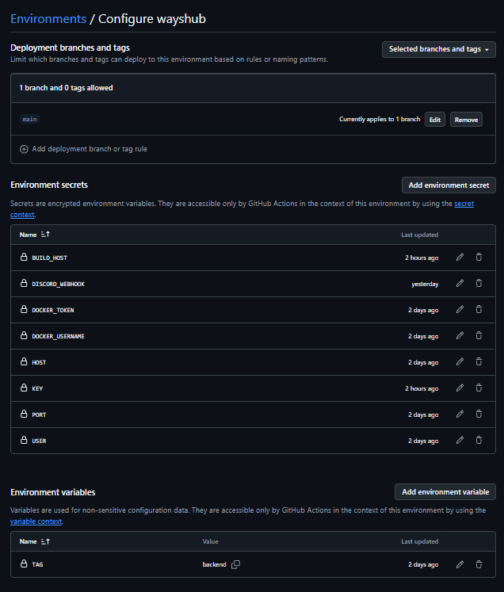

Di dalam environment saya setup secrets dan variable yang nanti akan digunakan untuk workflows github action

- BUILD_HOST : Host buat server build
- DISCORD_WEBHOOK : Link discord webhook saya
- DOCKER_TOKEN : Token buat github action akses docker saya
- DOCKER_USERNAME : Username docker saya
- HOST : Host disini maksudnya main host, berarti host backend karena ini repository backend
- KEY : Ini key untuk bisa mengakses server yang kunci ini bisa akses
- PORT : Ini sebenernya saya mengikuti contoh, port umumnya default 22 untuk keperluan github action tapi jika ada keperluan untuk diganti saya tinggal edit ini saja
- USER : User saya untuk mengakses server
- TAG : tag ini bisa dilihat backend, ini hanya variable biar saya bisa gunakan juga untuk frontend jika perlu

### Workflows GitHub Action

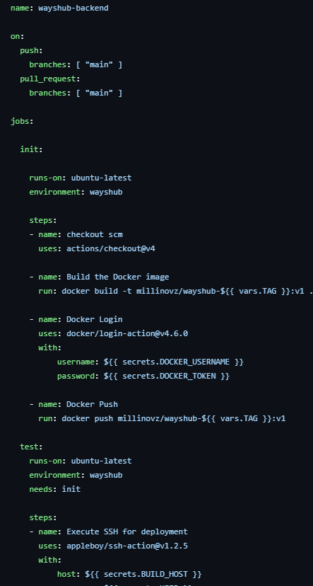

Foto di atas hanya memperlihatkan separuh jadi bisa lihat keseluruhan disini

[Workflows yml](https://github.com/millinov/weyshub-backend/blob/main/.github/workflows/docker-image.yml)

Flownya kurang lebih seperti ini:

1. Menggunakan actions/checkout@v4, git automatis di pull jadi saya langsung build di github action yang kemudian saya push
2. Mengakses build server dimana disitu dia pull image backend dan mengetestnya disitu
3. Jika test sukses maka github akan akses backend dan deploy aplikasinya disitu
4. Mengirim discord notif menggunakan plugin discord webhook github dan memberi tahu sukses atau tidaknya action ini

Ini automatis berjalan jika mengepush git ini ke main
