# Task Day 9 / Week 5 / Week 3 Stage 2

Disini saya mengerjakan task Bootcamp DevOps Day 9 atau Week 5 atau Week 3 Stage 2, Penamaan biar sama saya buat foldernya day 9.
Tasknya sendiri dikerjakan selama 1 minggu ini di week 5 bootcamp.

Buat pengerjaan saya akan buat dari cara pengerjaan saya baru saya pinpoint dari mana di task yang sudah saya kerjakan

## Terraform

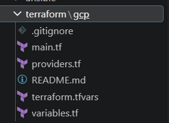

[Link Code](https://github.com/millinov/Automation/tree/main/terraform/gcp)

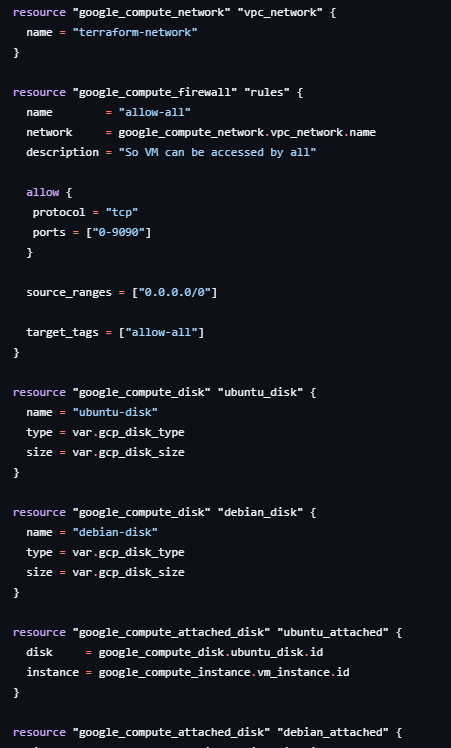

Saya membuat 2 VM di terraform 1 debian dan 1 ubuntu sesuai permintaan tugas, Ubuntu 24 tapi Debian aku buat 12 karena tidak ada Debian 11 di gcp, Selain itu aku tidak meng-attach IP static ke VM karena sudah di generate oleh googlenya.

Di koding di atas juga saya buat firewall rule buat bisa di akses all ip range, dengan tcp port range 0-9900

Kemudian juga saya setup disk yang nanti bakal di attach di VM nya dengan google_compute_attached_disk
Bisa di cek link diatas buat melihat lebih lanjut

Note: .tfvars termasuk ke dalam .gitignore jadi tidak ada di git

## Ansible

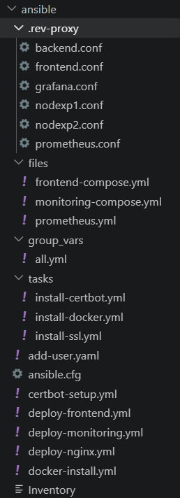

[Link Ansible yang saya buat](https://github.com/millinov/Automation/tree/main/ansible)

Ansible Inventory:
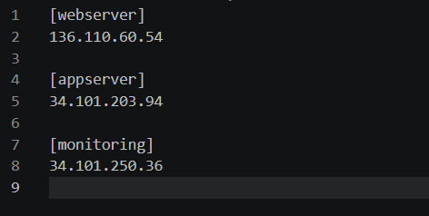

Ansible Config:
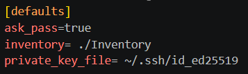

Ansible Variables:
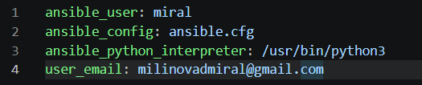

Saya membuat ansible untuk:

- Add user di semua host di inventory
    Membuat user, authenticate usernya terus buat each server bisa login menggunakan SSH maupun password

- Install docker di semua host
    Selain menginstall ansible juga akan cek apakah sudah ada docker atau belum

- Deploy nginx di web server
    Menginstall nginx dan juga meng-copy semual file reverse-proxy config dari .rev-proxy ke nginx, kemudian me-restart nginx

- Deploy frontend di app server
    Men-deploy aplikasi wayshub-frontend dan node-exported menggunakan docker compose, dimana ansible akan copy docker compose yang saya buat ke appserver

- Deploy monitoring (Grafana & Prometheus) di monitor server
    Men-deploy aplikasi grafana dan prometheus menggunakan docker compose, dimana ansible akan copy docker compose yang saya buat ke appserver

- Generate SSL Certificate menggunakan Certbot (Bukan wildcard SSL)
    Membuat SSL certificate buat domain-domain yang digunakan untuk reverse-proxy menggunakan loop

Buat lihat lebih detailnya bisa buka link di atas buat cek ansible saya

[Cek aplikasi wayshub yang sudah jalan](https://millinov.studentdumbways.my.id/)

## Monitoring

Seperti yang di jelaskan di atas, saya menggunakan Grafana yang akan melihat data dari Prometheus, dimana Prometheus menerima data dari Node-Exporter yang saya install di appserver

[Link Grafana](https://monitoring-millinov.studentdumbways.my.id/)

[Link Prometheus](https://prom-millinov.studentdumbways.my.id/)

Grafana:
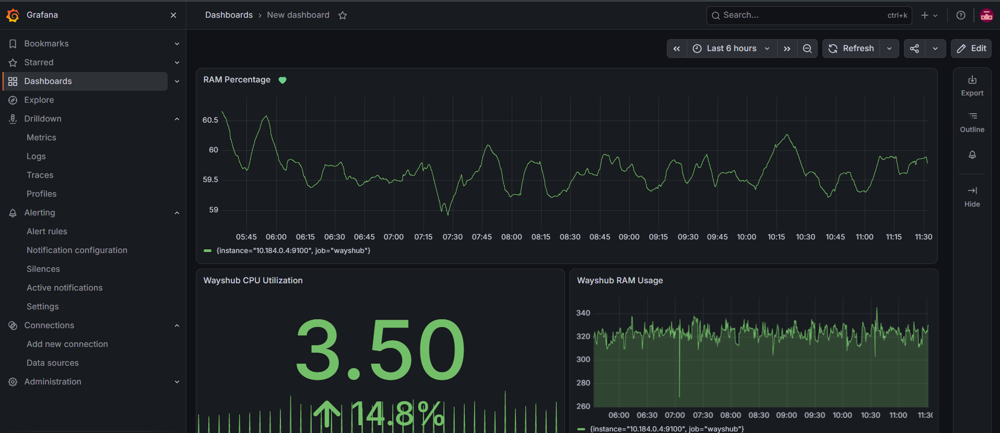

Prometheus
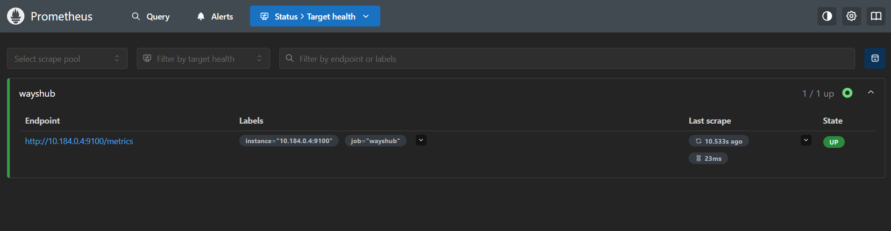

Seperti yang di lihat di gambar Grafana saya sudah membuat dashboard buat Wayshub

Terjadi kendala saat saya mencoba buat install node-exporter buat monitoring, buat next time saya akan buat server monitoring specnya lebih bagus

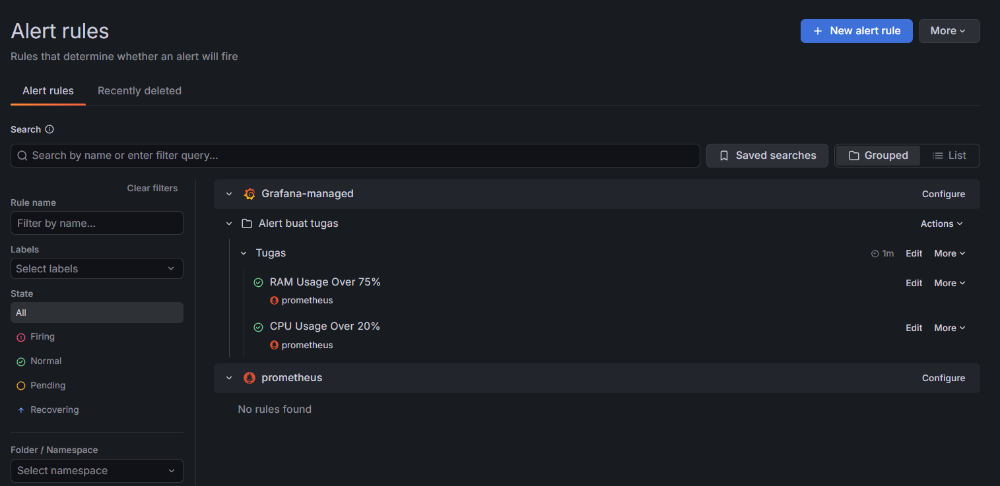

Saya juga sudah buat 2 rule di Grafana untuk memberi notifikasi menggunakan discord webhook yaitu:
- CPU digunakan melebihi 20%
- RAM digunakan melebihi 75%

#### CPU digunakan melebihi 20%

```
100 - (
    avg by(instance) (
        irate(
            node_cpu_seconds_total{
                mode='idle', 
                job='wayshub', 
                instance="10.184.0.4:9100"
                }[5m]
            )
        ) * 100
    ) 
```

Jadi dari promql diatas bisa dilihat kita menghitung dulu CPU yang tidak digunakan secara average dalam kurun waktu 5 menit.
Nah karena kondisinya masih 0 koma, kita kali 100.
Buat tau berapa persen yang digunakan, maka kita buat 100 - CPU yang tidak dipake * 100

Nah rulenya akan berjalan jika sudah melebihi thresholdnya yaitu 20

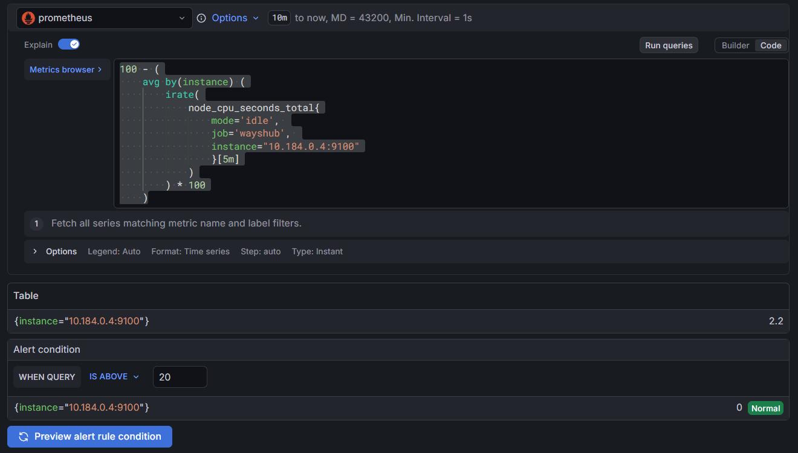

#### RAM digunakan melebihi 75%

```
(1 - (
    (
        avg_over_time(node_memory_MemFree_bytes{
            job="wayshub",
            instance="10.184.0.4:9100"
        }[10m]) +
        avg_over_time(node_memory_Cached_bytes{
            job="wayshub",
            instance="10.184.0.4:9100"
        }[10m]) +
        avg_over_time(node_memory_Buffers_bytes{
            job="wayshub",
            instance="10.184.0.4:9100"
        }[10m])
    ) / avg_over_time(node_memory_MemTotal_bytes{
            job="wayshub",
            instance="10.184.0.4:9100"
        }[10m])
)) * 100
```

Buat promql untuk rule RAM saya menghitung semua variable ram yg kepake jadi 1 - (total ram yang kepake/total ram)
Nah kan hasilnya 0 koma, jadi saya kali 100 buat tampilan persen.

Ini spekulasi saya tapi mungkin ini bisa di buat simple menggunakan 'node_memory_MemAvailable_bytes' tapi saya mengikuti video dari mentor
Buat di dashboard saya ada promql menggunakan 'node_memory_MemAvailable_bytes' untuk melihat berapa banyak ram yang digunakan dalam ukuran MB

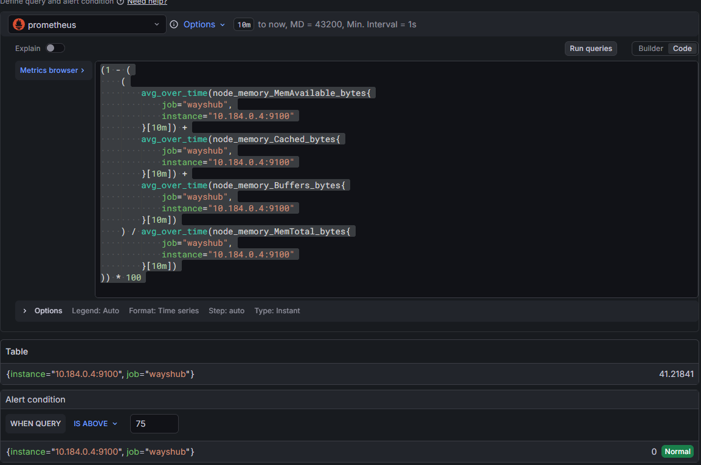


