# Final Project

Ini adalah Final Project untuk Bootcamp Devops yang saya lakukan
Project ini di kerjakan dalam waktu seminggu

Buat pengerjaan saya akan buat dari cara pengerjaan saya baru saya pinpoint dari mana di task yang sudah saya kerjakan

*Koding-koding di folder sudah dirubah dan hanya digunakan sebagai contoh yang saya kerjakan

[Dumbmerch Staging](https://staging.millinov.studentdumbways.my.id/)  

[Dumbmerch Production](https://millinov.studentdumbways.my.id/)

## Pertama, setup terraform

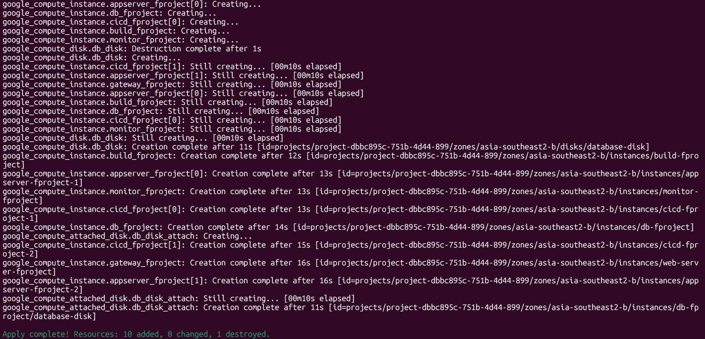

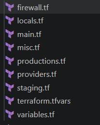

Saya membuat folder terraform seperti diatas dengan namanya dibagi sesuai kebutuhan

[Bisa lihat disini](automation-fproject/terraform/gcp/)

Aku membuat 2 firewall yang hanya memperbolehkan port yang akan digunakan,  
Salah satu untuk private, satu lagi untuk public

Ini kurang lebih gambarannya:  
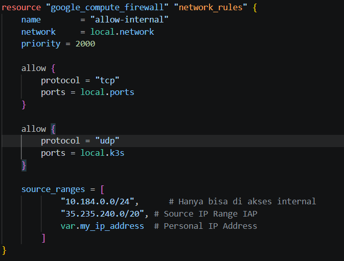  
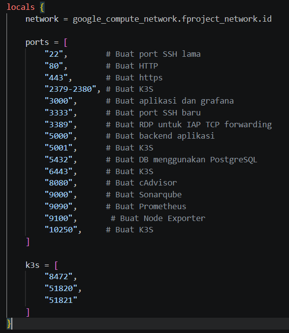

Untuk lebih lanjutnya bisa lihat kodingannya

Selain itu saya mengalami kendala dimana ada maksimal VM yang bisa di buat dengan public IP jadi di terraform untuk semua VM, kecuali untuk web-server, build-server, dan kubernetes node, tidak memiliki public IP.

Semua VM menggunakan ubuntu-os-cloud/ubuntu-minimal-2404-lts-amd64

Ini gambaran akhir setelah saya apply terraformnya:  
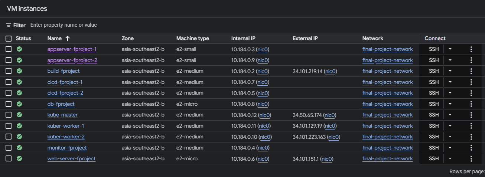

## Kedua, setup Ansible

[Inventory Ansible](automation-fproject/ansible/Inventory)

Saya buat inventorynya rapih dan ada parent-children grouping juga untuk kebutuhan saya  

Untuk Playbooknya:

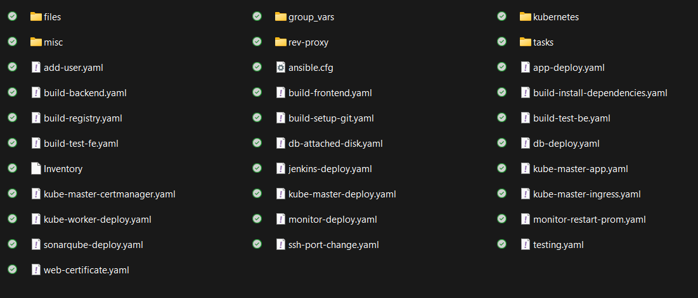

- add-user : Add User finaltask-miral ke semua VM
- app-deploy : Deploy aplikasi Frontend & Backend Dumbmerch ke Appserver
- build-registry : Deploy aplikasi Registry Docker untuk private image push
- build-* : keperluan testing seperti melihat aplikasi atau test build image dll.
- db-deploy : Deploy postgresql ke server database
- jenkins-deploy: Deploy Jenkins ke server jenkins
- kube-master-deploy: Install k3s - lighweight kubernetes ke server master
- kube-master-app: Meng-apply semua manifest yang di buat di folder kubernetes ke node master
- kube-master-*: Meng-install dependecies yang dibutuhkan seperti cert manager dan ingress nginx
- kube-worker-deploy: Install k3s - lighweight kubernetes agent ke server worker-worker
- monitor-deploy: Deploy Prometheus & Grafana ke server monitoring
- monitor-restart-prom: Restart prometheus dan apply config baru jika ada yang dirubah
- sonarqube-deploy: Deploy sonarqube ke server sonarqube
- ssh-port-change: ubah port ssh dari 22 ke 3333 sesuai permintaan task, dan ini hanya bisa dijalankan sekali kalau tidak nanti ada adjust yang di lakukan di playbooknya
- testing: testing ansible playbook
- web-deploy: Install nginx dan apply reverse-proxy
- web-certificate: Install certbot dan bikin SSL Wildcard Certificate
- web-incrase-bucket-size: Increase setting di nginx config agar bisa reverse proxy lebih banyak
- web-node-deploy: Deploy Node-Exporter* di web-server

*Semua deploy ada node exporter tapi web dibedakan karena nginxnya native dan tidak melalui docker jadi perlu diinstall dockernya

Untuk group_vars aku bagi-bagi seperti ini:  
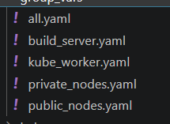

Bisa lihat isinya di [sini](automation-fproject/ansible/group_vars/)

Public dan Private itu crucial karena cara mereka ssh login berbeda jadi harus di pisah

## Ketiga, Build & Deploy aplikasi di staging

Untuk step by step saya bagaimana saya melakukan ini:

1. Test aplikasinya bisa jalan, frontend menggunakan react, backend menggunakan golang
2. Jika bisa jalan, coba build imagenya, ini saya menggunakan playbook build di ansible
3. Jika image sukses di build maka langsung coba deploy di appserver
4. Jika aplikasi sudah jalan, setup reverse proxy dan ssl
5. Setelah itu, setup CI/CD menggunakan jenkins

### No. 1

Step ini untuk mem-familiarisasi dengan aplikasi dumbmerch, cari tau cara build dan run terutama untuk backend yang menggunakan golang

### No. 2

Frontend:  

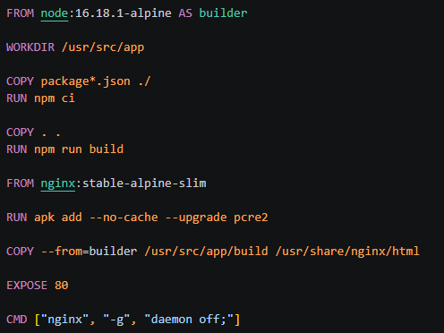

Saya buat seperti ini buat lebih ringan imagenya, RUN apk add --no-cache --upgrade pcre2 ini hanya fixing vulnerabilities yang ada di aplikasi

Backend:

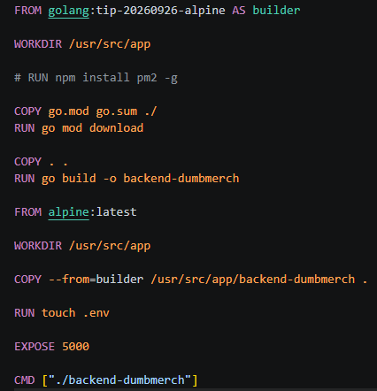

Cara run golang harus di build dulu dan jalan file hasil buildnya.  
Kenapa ada "RUN touch .env"? karena aplikasi backend ini ada validasi kalo saat di run ada .env di directory itu, untuk bypass ini agar bisa setup environtment di luar .env saya buat .env kosong dengan command itu

### No. 3

Step ini saya menjalankan playbook app-deploy ke server-server aplikasi, playbooknya akan install docker jila belum dan membuat docker compose yang isinya aplikasi dumbmerch + node exporter

### No. 4

Selanjutnya saya buat .conf reverse proxy nya dan jalankan playbook web-deploy untuk mengcopy .conf nya ke web-server dan apply reverse proxy + load balancing karena ada lebih dari 1 server

Untuk setup ssl certificate, dari playbook web-certificate ada alamat directory certificate, saya copy-paste itu ke .conf reverse proxy aplikasi dumbmerch

### No. 5

Dan untuk CI/CD akan saya lanjutkan di point besar selanjutnya

## Keempat, Jenkins

Saya menginstall jenkins langsung dari compose  
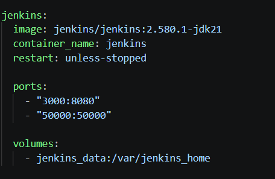  

Kenapa tidak menggunakan cara dari docsnya atau yang telah diajarkan? Saya rencana akan membuat agen jenkins di build-server jadi jenkins tidak perlu membuat docker inside of socker buat jalanin job-job

Untuk jobs di jenkins ada 4 untuk masing-masing app dan staging production branch nya

Tidak ada perbedaan jauh cara saya membuat job dari task kemarin, saya tapi tambah plugin untuk testing menggunakan sonarqube  
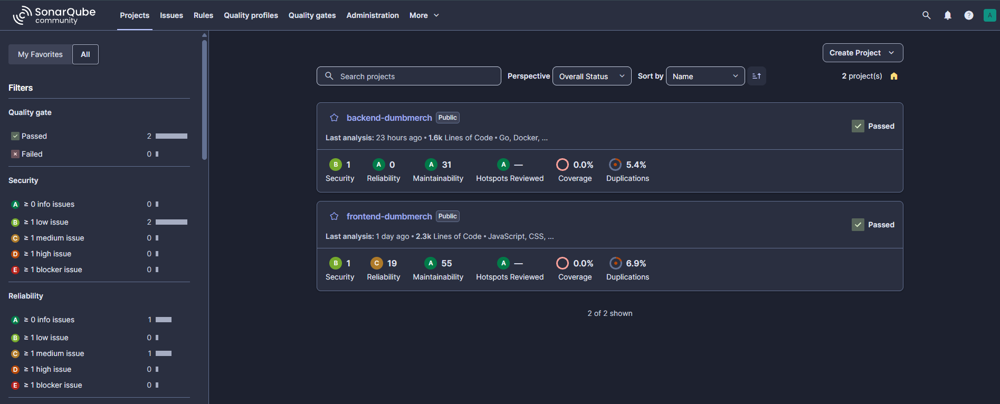

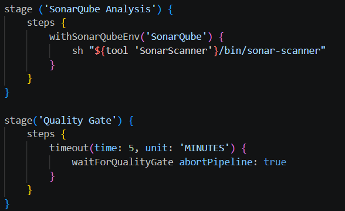  
Ini cara menggunakan sonarqube di Jenkinsfile

Jadi dengan fitur testing ini Jenkinsfilenya juga berubah, bisa lihat kodingannya di [sini](jenkins)

Selain sonarqube, untuk testing saya juga menggunakan trivy untuk mengecek ada vulnerabilities atau tidak di image aplikasi.  
Untuk trivy saya hanya langsung di build jobnya:  
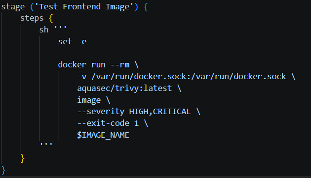

Fase testing ini tapi hanya untuk staging dan tidak ada di job production

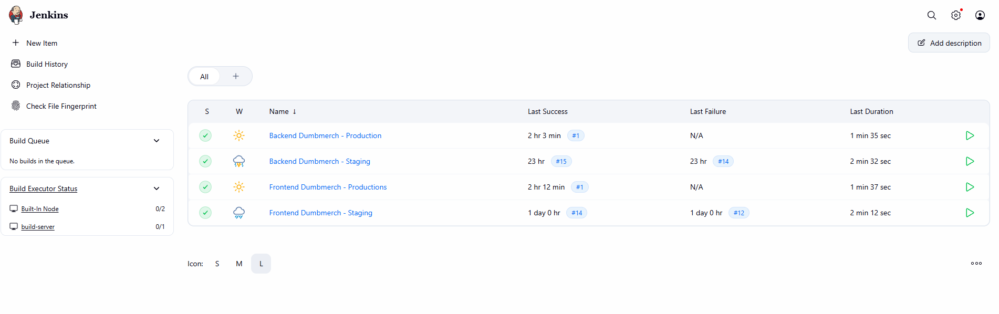

Untuk setup ssl certificate, dari playbook web-certificate ada alamat directory certificate, saya copy-paste itu ke .conf reverse proxy aplikasi Jenkins

## Kelima, setup monitoring

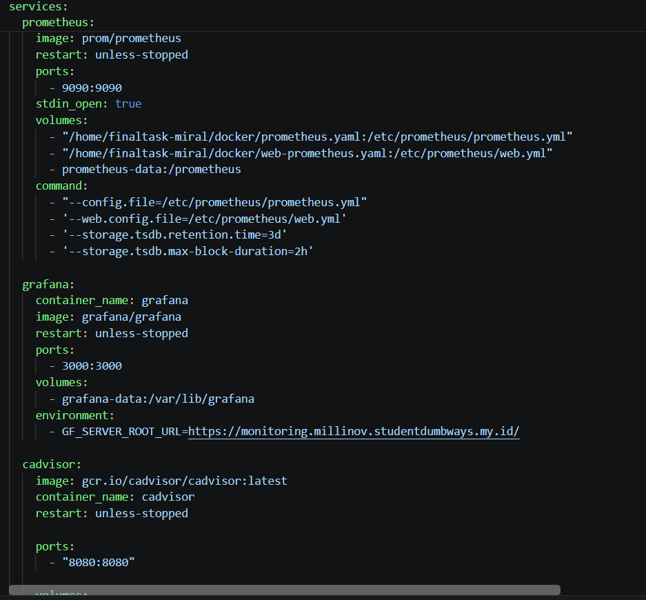

Monitoring deploynya kurang lebih sama seperti tugas kemarin di composenya, untuk prometheus di minta membuat basic authentication jadi saya buat web config untuk setup itu

Node exporter juga di taro di setiap docker compose:  
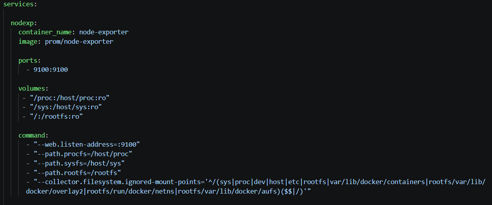

Untuk prometheus config sekarang isinya lebih banyak, ini gambaran isinya  
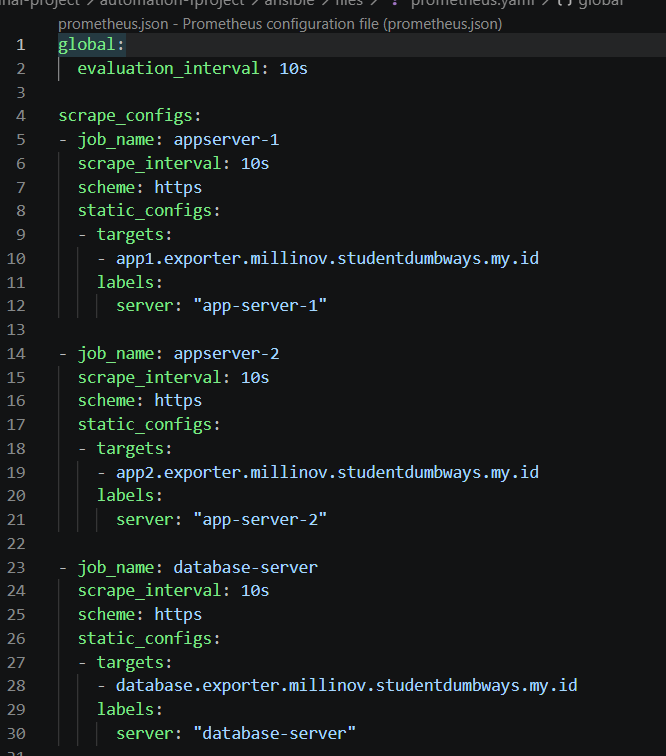  
Bisa cek seluruhnya di [sini](automation-fproject/ansible/files/prometheus.yaml)

Ini dashboard grafana:  
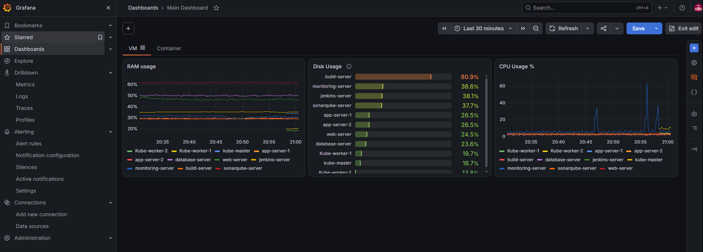  
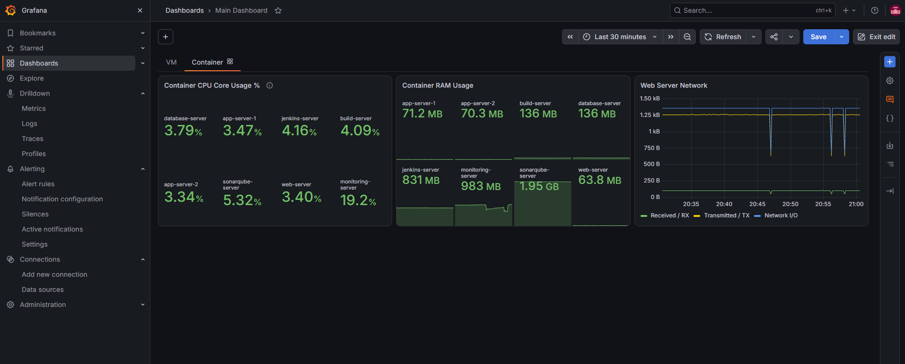

Saya juga sudah setup alert yang di tugaskan:  
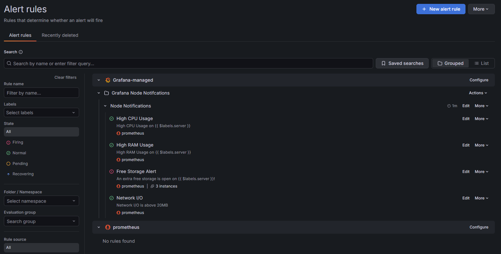

Alertnya akan di kirim ke telegram:  
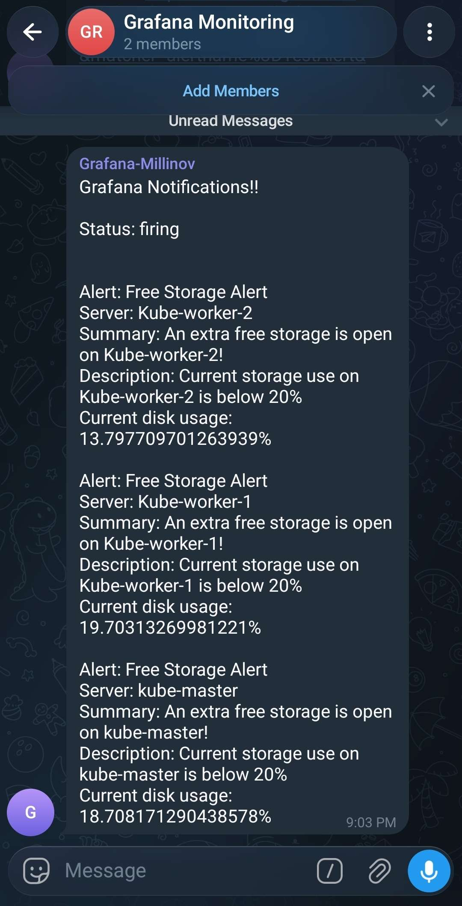

Untuk setup ssl certificate, dari playbook web-certificate ada alamat directory certificate, saya copy-paste itu ke .conf reverse proxy aplikasi monitoring ini termasuk semua node-exporter staging

## Keenam, setup production

Untuk production aplikasi jalan dalam Kubernetes, until project ini saya menggunakan K3S Lightweight

Kodingan manifest yang di jalankan bisa di lihat di [sini](automation-fproject/ansible/kubernetes/)

Semua manifest yang ada disitu di apply dengan playbook kube-master-app.yaml

Ini app yang di kubernetes:  
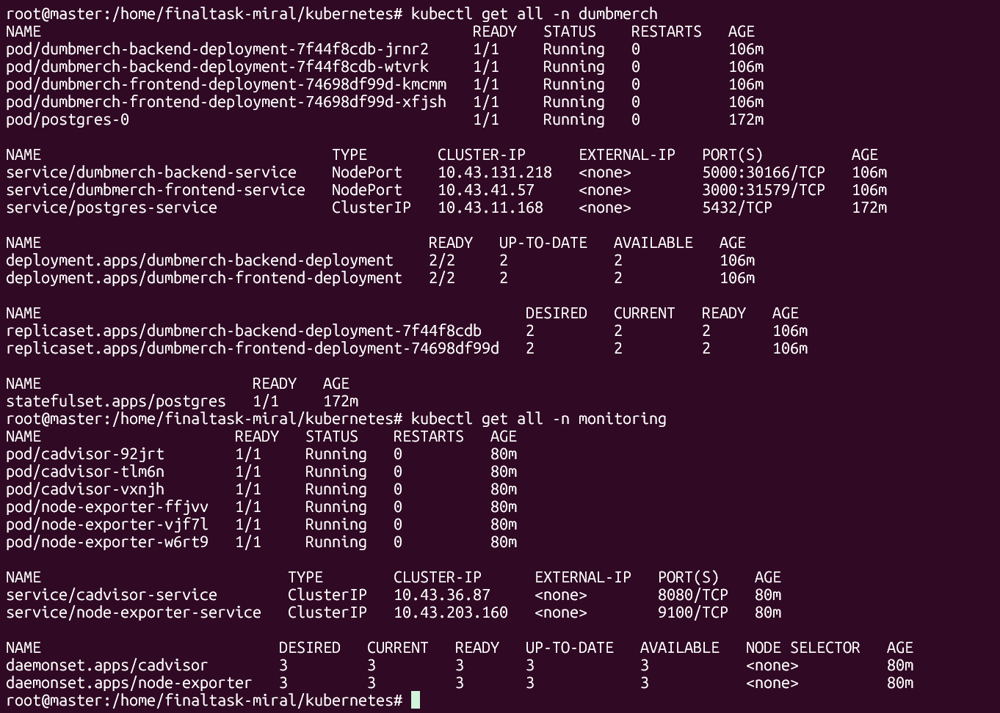

